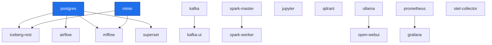
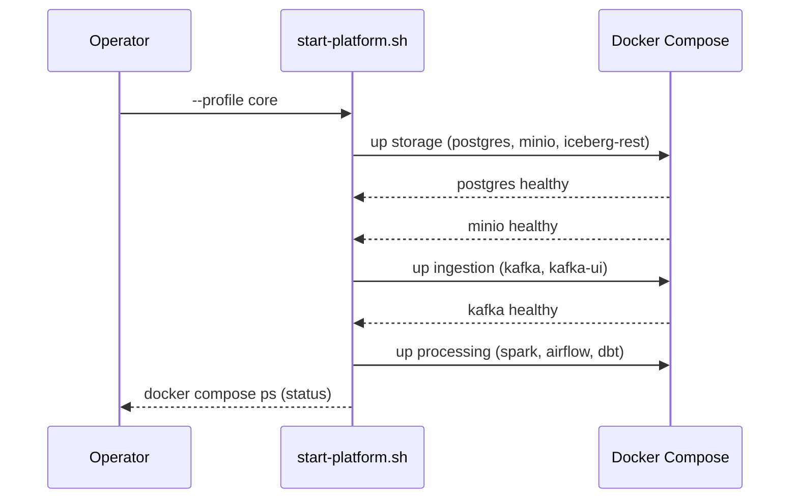
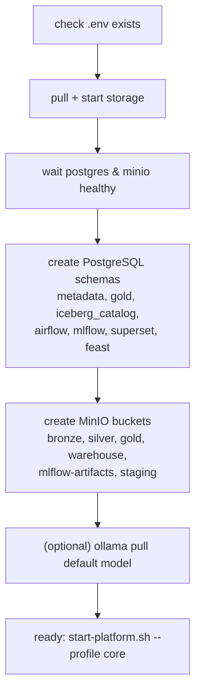

# 16 — Service Dependency & Startup Strategy

> **Phase 7 — Infrastructure Implementation**
> Startup order, health-gated dependencies, readiness retries, and the
> one-time initialization sequence for the local platform.

This document specifies **Task 8** of Phase 7. It formalizes how the platform
comes up deterministically despite asynchronous container startup, building on
the dependency inventory in [03-service-mapping](./03-service-mapping.md).

---

## 1. Dependency principles

| Principle | Mechanism |
| --- | --- |
| Foundation first | Storage (PostgreSQL, MinIO) is a hard prerequisite for almost everything. |
| Health-gated startup | `depends_on: { condition: service_healthy }` blocks dependents until a healthcheck passes. |
| Idempotent init | `bootstrap.sh` creates schemas/buckets safely on re-run (`IF NOT EXISTS`, `--ignore-existing`). |
| Self-healing | `restart: unless-stopped` (services) / `on-failure:3` (workers) recovers from transient failures. |
| Staged scripting | `start-platform.sh` brings stacks up in waves and waits for health between waves. |

---

## 2. Dependency graph

Services with **no** hard `depends_on` (kafka, spark-master, qdrant, ollama,
prometheus, otel-collector) can start in parallel within their wave; the scripts
still sequence waves to respect resource pressure on a 16 GB laptop.

---

## 3. Health checks

Every long-running service defines a Docker healthcheck so dependents wait for
*readiness*, not merely *process start*.

| Service | Probe | Interval / Retries |
| --- | --- | --- |
| postgres | `pg_isready -U $USER -d $DB` | 10s / 5 |
| minio | `curl /minio/health/live` | 15s / 5 |
| iceberg-rest | `curl /v1/config` | 20s / 5 |
| kafka | `kafka-broker-api-versions.sh --bootstrap-server localhost:9092` | 20s / 5 |
| spark-master | `curl :8080` | 20s / 5 |
| airflow | `curl /health` | 30s / 5 |
| mlflow | `curl /health` | 30s / 5 |
| qdrant | TCP open on 6333 | 20s / 5 |
| ollama | `curl /api/tags` | 30s / 5 |
| prometheus | `wget /-/healthy` | 20s / 5 |
| grafana | `curl /api/health` | 30s / 5 |
| superset | `curl /health` | 30s / 5 |

`condition: service_healthy` consumers (iceberg-rest, kafka-ui, airflow, mlflow,
spark-worker, open-webui, superset) will not be scheduled until the upstream
healthcheck reports `healthy`.

---

## 4. Startup sequence (per `start-platform.sh`)

Wave ordering by profile:

| Wave | Profile(s) | Services | Gate before next wave |
| --- | --- | --- | --- |
| 1 | storage | postgres, minio, iceberg-rest | postgres + minio healthy |
| 2 | core | kafka, kafka-ui | kafka healthy |
| 3 | core | spark-master, spark-worker, airflow | — |
| (alt) | ai | mlflow, jupyter, qdrant, ollama, open-webui | depends on storage healthy |
| (alt) | obs | prometheus, grafana, otel, superset | depends on storage healthy |

The script's `wait_healthy()` helper polls `docker inspect` until
`State.Health.Status == healthy`, providing an application-level readiness
retry on top of Docker's own probe retries.

---

## 5. One-time initialization sequence (`bootstrap.sh`)

Idempotency guarantees:

| Step | Idempotent mechanism |
| --- | --- |
| Schemas | `CREATE SCHEMA IF NOT EXISTS` |
| Buckets | `mc mb --ignore-existing` |
| Airflow metadata | `airflow db migrate` (safe to re-run) |
| Superset metadata | `superset db upgrade && superset init` |

---

## 6. Readiness & retry mechanisms (summary)

| Layer | Retry behavior |
| --- | --- |
| Docker healthcheck | per-service `interval` × `retries` before marking unhealthy |
| `depends_on: service_healthy` | dependent stays pending until upstream healthy |
| `start-platform.sh wait_healthy()` | polls every 3s until healthy before next wave |
| Restart policy | `unless-stopped` (services), `on-failure:3` (spark-worker, ollama) |
| Connection-level | clients (airflow→postgres, mlflow→minio) reconnect on transient errors |

---

## Cross references

- [03-service-mapping](./03-service-mapping.md) — full container/port/volume inventory
- [11-failure-handling](./11-failure-handling.md) — restart & recovery policies
- [10-deployment-runbook](./10-deployment-runbook.md) — operator run procedure
- `infrastructure/scripts/start-platform.sh`, `infrastructure/scripts/bootstrap.sh`
