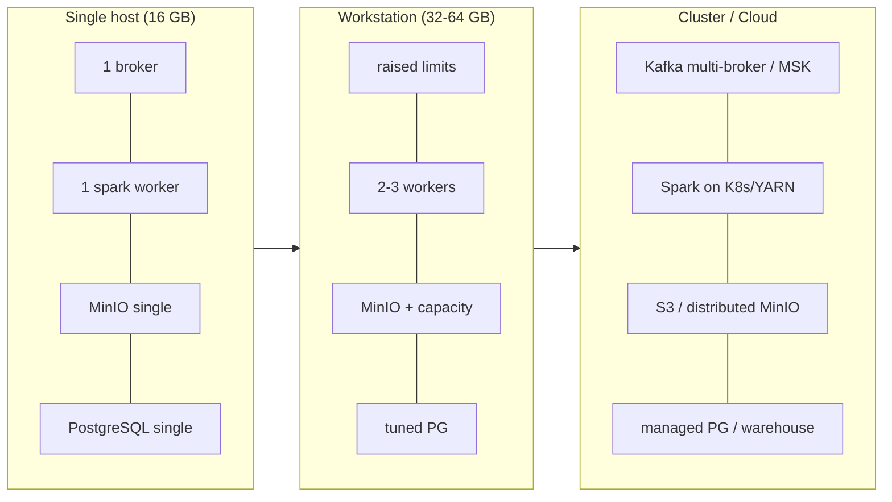

# 17 — Scalability Strategy

> **Phase 7 — Infrastructure Implementation**
> How the local, single-host platform would scale beyond a 16 GB laptop —
> per service and as a whole — without changing the application contracts.

This document specifies **Task 13** of Phase 7. The local design is
deliberately single-node; this is the documented path from laptop → workstation
→ cluster/cloud. It complements the Phase 3 architecture scalability view
([../../architecture/11-scalability-design.md](../../architecture/11-scalability-design.md)).

---

## 1. Scaling philosophy

| Principle | Rationale |
| --- | --- |
| Stateless compute, stateful storage | Scale compute (Spark, ingestion, API) horizontally; scale storage by capacity/replication. |
| Contract stability | S3 (MinIO→cloud), JDBC (PostgreSQL), Kafka protocol, and Iceberg catalog stay constant as backends grow. |
| Vertical first, then horizontal | On one host, raise `mem_limit`/`cpus`; beyond it, add nodes/replicas. |
| Decouple via the lakehouse | Producers and consumers meet at object storage + Iceberg, so layers scale independently. |

---

## 2. Scaling dimensions overview

---

## 3. Per-service scaling path

| Service | Local (now) | Vertical step | Horizontal / cloud step |
| --- | --- | --- | --- |
| **Kafka** | 1 KRaft node, RF=1, 3 partitions | More heap, more partitions | Multi-broker quorum, RF≥3, rack awareness; or managed (MSK/Redpanda) |
| **Spark** | master + 1 worker (2 cores, 1.5 GB) | More worker cores/memory | Add `spark-worker` replicas; then Spark-on-Kubernetes / YARN, dynamic allocation |
| **MinIO** | single server, single drive | Larger volume | Distributed MinIO (erasure coding, ≥4 nodes) or swap to AWS S3 / GCS |
| **PostgreSQL** | single instance, multi-schema | More shared_buffers/CPU | Read replicas + PgBouncer; move Gold serving to a warehouse (e.g. cloud DW) |
| **Iceberg catalog** | JDBC catalog on PostgreSQL | — | REST catalog backed by scalable metastore; storage already S3-compatible |
| **Airflow** | `standalone`, LocalExecutor | More parallelism/tasks | CeleryExecutor (Redis + workers) or KubernetesExecutor |
| **MLflow** | single server | — | Replicas behind LB; artifacts already on object storage |
| **Qdrant** | single node | More memory | Qdrant cluster (sharding + replication) |
| **Ollama** | single, 1 loaded model | GPU / more RAM | Multiple replicas behind a gateway; or hosted inference API |
| **Prometheus** | single, 72h retention | More retention/RAM | Remote-write to Thanos/Mimir/Cortex for long-term + HA |
| **Superset** | single web process | — | Gunicorn workers + Celery + Redis cache, replicas behind LB |
| **FastAPI** (later) | single (planned) | — | Stateless replicas behind LB/ingress |

---

## 4. How Kafka scales

1. **Partitions** — increase `KAFKA_NUM_PARTITIONS` (and per-topic partitions) to raise consumer parallelism; each partition is consumed by at most one consumer in a group.
2. **Brokers** — move from a single combined broker+controller to a multi-node KRaft quorum; set replication factor ≥ 3 for durability.
3. **Throughput** — add brokers and spread partitions; producers/consumers are unchanged because they speak the same protocol and bootstrap address.
4. **Managed** — lift-and-shift to MSK / Confluent / Redpanda by changing only `BOOTSTRAPSERVERS`.

---

## 5. How Spark scales

1. **Workers** — `docker compose ... up --scale spark-worker=N` adds executors to the standalone cluster (host RAM permitting).
2. **Resources** — tune `SPARK_WORKER_CORES`, `SPARK_WORKER_MEMORY`, and executor sizing for larger jobs.
3. **Cluster managers** — graduate from standalone to **Spark-on-Kubernetes** or YARN for elastic, multi-host scheduling and dynamic allocation.
4. **Storage decoupling** — input/output already on S3A + Iceberg, so scaling compute needs no data migration.

---

## 6. How storage scales

| Concern | Path |
| --- | --- |
| Object storage capacity | Single MinIO → distributed MinIO (erasure-coded, ≥4 nodes) → cloud S3/GCS (endpoint swap only). |
| Relational metadata/serving | Single PostgreSQL → read replicas + connection pooling → dedicated cloud warehouse for Gold/BI. |
| Table format | Iceberg gives partition evolution, compaction, and snapshot expiry to manage large tables regardless of backend. |
| Data growth controls | Partitioning + lifecycle/retention (see [06-storage-design](./06-storage-design.md)) keep scan cost bounded as volume grows. |

---

## 7. Platform-wide scaling envelope

| Tier | Host | Profiles feasible | Notes |
| --- | --- | --- | --- |
| Laptop | 16 GB | one profile at a time (`core` *or* `ai`) | Avoid Spark+Ollama peak together. |
| Workstation | 32–64 GB | `all` concurrently | Raise limits, add 2–3 Spark workers. |
| Single server | 128 GB+ | `all` + replicas | Begin externalizing object storage. |
| Cluster / cloud | many nodes | per-service autoscaling | Kubernetes; managed Kafka/PG/object store. |

---

## 8. Trade-offs of the scaling approach

| Choice | Benefit | Cost |
| --- | --- | --- |
| Single-node local default | Fits 16 GB, fast to run, low complexity | No HA/autoscaling locally (acceptable for dev) |
| S3-compatible from day one | Cloud migration is an endpoint swap | MinIO single-node has no local redundancy |
| Standalone Spark/Airflow | Minimal memory footprint | Manual scale-out; not production-elastic |
| Protocol-stable interfaces | Backends grow without app rewrites | Some managed services add cost at scale |

---

## Cross references

- [04-resource-management](./04-resource-management.md) — per-service limits & profile envelopes
- [12-trade-offs](./12-trade-offs.md) — technology trade-offs
- [16-service-dependency](./16-service-dependency.md) — startup & dependency model
- [../../architecture/11-scalability-design.md](../../architecture/11-scalability-design.md) — Phase 3 scalability view
