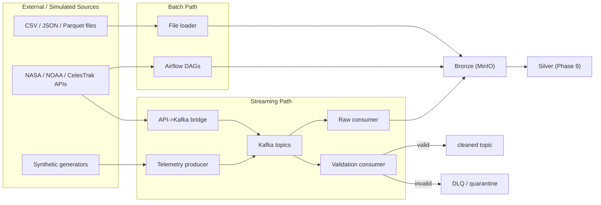

# 01 - Ingestion Layer Overview

> **Phase 8 - Data Ingestion** · Document 01 of 17

## Purpose

Define how data physically enters the Space Mission Data & AI Platform: the end-to-end ingestion lifecycle, the split between streaming and batch, and the role of Kafka, Airflow, external APIs, and MinIO. This is an **implementation** phase — the design here is realised by the code under [`ingestion/`](../../ingestion/).

## Scope

| In scope | Out of scope (later phases) |
| --- | --- |
| Streaming ingestion (Kafka) | Silver/Gold transformations (Phase 9+) |
| Batch ingestion (Airflow) | Feature engineering / ML training |
| API + file ingestion | BI dashboards |
| Synthetic telemetry/orbit/weather generation | Serving APIs |
| Landing zone (Bronze) + ingestion-time validation | Catalog/governance tooling |

## End-to-End Ingestion Lifecycle

## Streaming vs Batch Separation

| Dimension | Streaming (Kafka) | Batch (Airflow) |
| --- | --- | --- |
| Sources | telemetry, space weather, orbit updates | imagery metadata, fire/weather archives, TLE catalog |
| Latency target | < 5 s (telemetry) | minutes → daily |
| Trigger | event arrival | schedule / sensor |
| Volume per event | small messages | larger pulls |
| Code | `ingestion/streaming/` | `ingestion/batch/` |

Both paths converge on the **same Bronze layer**, preserving a single source of truth (see [architecture/06-data-architecture.md](../../architecture/06-data-architecture.md)).

## Component → Code Map

| Concern | Module |
| --- | --- |
| Settings | [ingestion/config/settings.py](../../ingestion/config/settings.py) |
| Bronze envelope | [ingestion/common/envelope.py](../../ingestion/common/envelope.py) |
| Kafka IO | [ingestion/common/kafka_io.py](../../ingestion/common/kafka_io.py) |
| MinIO landing | [ingestion/common/minio_io.py](../../ingestion/common/minio_io.py) |
| Simulation | [ingestion/simulation/](../../ingestion/simulation/) |
| API connectors | [ingestion/api/](../../ingestion/api/) |
| Streaming | [ingestion/streaming/](../../ingestion/streaming/) |
| Batch DAGs | [ingestion/batch/dags/](../../ingestion/batch/dags/) |
| Quality | [ingestion/quality/](../../ingestion/quality/) |

## Design Principles

- Open-source only; fits a 16 GB laptop (single-broker Kafka, LocalExecutor Airflow).
- No secrets in code — all credentials from `infrastructure/env/.env`.
- At-least-once delivery; nothing is dropped — bad data is quarantined.
- Bronze is immutable and replayable.

## Cross References

- [02-streaming-design.md](02-streaming-design.md) · [03-batch-design.md](03-batch-design.md) · [07-landing-zone.md](07-landing-zone.md)
