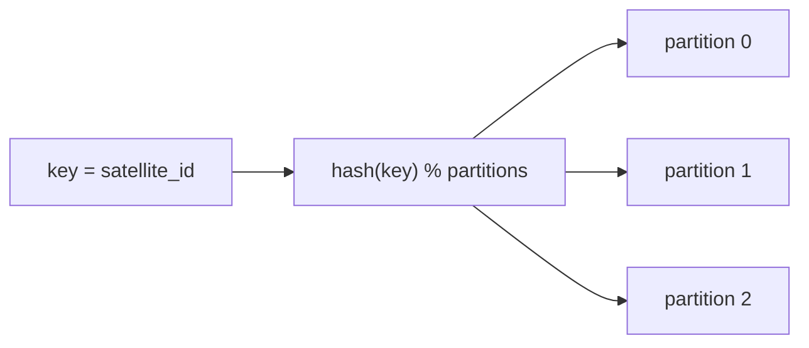

# 02 - Streaming Ingestion Design (Kafka)

> **Phase 8 - Data Ingestion** · Document 02 of 17

## Purpose

Design the Kafka streaming ingestion layer: topics, partitioning, message structure, producers, consumers, and offset management. Implemented in [`ingestion/streaming/`](../../ingestion/streaming/) and [`ingestion/common/kafka_io.py`](../../ingestion/common/kafka_io.py).

## 1. Topic Strategy

| Topic | Purpose | Partitions | Producer | Consumer |
| --- | --- | --- | --- | --- |
| `telemetry.satellite.raw` | raw synthetic/API telemetry | 3 | telemetry producer | raw + validation consumers |
| `telemetry.satellite.cleaned` | validated telemetry | 3 | validation consumer | downstream (Phase 9) |
| `telemetry.satellite.dlq` | rejected records | 1 | validation consumer | manual replay |
| `space.weather.events` | Kp / flare events | 1 | API bridge / sim | alerting |
| `launch.events` | launch schedule events | 1 | API bridge | context enrichment |
| `orbit.position.stream` | orbit positions / GP sets | 3 | bridge / orbit sim | revisit planning |

Topic names are centralised in [settings.py](../../ingestion/config/settings.py) (`KafkaSettings`).

## 2. Partition Strategy



- **Satellite-based:** message key = `satellite_id` → all telemetry for a satellite lands on one partition, preserving per-satellite ordering.
- **Time-based:** Bronze objects are partitioned by `ingest_date` downstream (storage), not at the topic level, to avoid hot partitions.
- DLQ is single-partition (low volume, ordering aids triage).

## 3. Message Structure (conceptual)

```json
{
  "timestamp": "2026-06-30T00:00:01Z",
  "satellite_id": "SAT-001",
  "sensor_type": "bus_payload",
  "payload": { "battery_voltage": {"value": 28.0, "unit": "V", "status": "NOMINAL"} },
  "metadata": { "generator": "synthetic", "schema_version": 1, "health": "NOMINAL" }
}
```

Bronze write wraps this in the standard envelope (`_ingest_id`, `_source`, `_checksum`, …) — see [08-schema-strategy.md](08-schema-strategy.md).

## 4. Producer Design

| Producer | Source → Topic | Notes |
| --- | --- | --- |
| `telemetry_producer` | synthetic generator → `telemetry.satellite.raw` | key=satellite_id; rate-controlled |
| `api_bridge_producer` | SWPC/CelesTrak → events/orbit | turns pull APIs into streams |

Producers are idempotent (`enable_idempotence=True`, `acks=all`) to avoid duplicates on retry.

## 5. Consumer Design

| Consumer | Role |
| --- | --- |
| `raw_ingest_consumer` | storage writer: batches → Bronze NDJSON in MinIO |
| `validation_consumer` | validates → `cleaned` or `dlq` (quarantine) |

A separate "raw" writer guarantees durability before any transformation; the validation consumer is independently scalable.

## 6. Offset Management Strategy

- `enable_auto_commit=False`; offsets committed **only after** a durable Bronze write or successful route → **at-least-once** delivery.
- Consumer group ids: `bronze-raw-writer`, `telemetry-validator`.
- On handler failure, offsets are not committed → message is re-delivered; persistent failures route to DLQ.

## Cross References

- [10-error-handling.md](10-error-handling.md) · [11-observability.md](11-observability.md) · [13-scalability.md](13-scalability.md)
