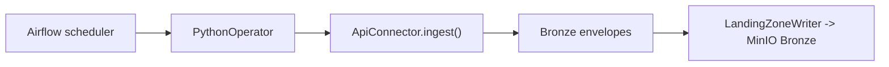

# 03 - Batch Ingestion Design (Airflow)

> **Phase 8 - Data Ingestion** · Document 03 of 17

## Purpose

Design the Airflow batch ingestion system: DAG categories, scheduling, retry/backoff, and incremental loads. Implemented in [`ingestion/batch/`](../../ingestion/batch/).

## DAG Categories

| DAG | Source | Schedule | File |
| --- | --- | --- | --- |
| `ingest_nasa_firms` | NASA FIRMS / VIIRS fire | hourly | [nasa_firms_ingest_dag.py](../../ingestion/batch/dags/nasa_firms_ingest_dag.py) |
| `ingest_noaa_swpc` | NOAA SWPC Kp | every 15 min | [noaa_swpc_ingest_dag.py](../../ingestion/batch/dags/noaa_swpc_ingest_dag.py) |
| `ingest_celestrak_tle` | CelesTrak GP/TLE | every 6 h | [celestrak_tle_ingest_dag.py](../../ingestion/batch/dags/celestrak_tle_ingest_dag.py) |
| `ingest_nasa_power` | NASA POWER weather | daily | [nasa_power_ingest_dag.py](../../ingestion/batch/dags/nasa_power_ingest_dag.py) |

Earth-observation imagery (Sentinel/Landsat) ingestion lands **metadata + object keys** (not pixels) — same pattern, deferred to expansion due to volume.

## DAG Design Rules

| Rule | Setting |
| --- | --- |
| Retries | 3 |
| Retry delay | 2 min, exponential backoff |
| Max retry delay | 30 min |
| Catchup | disabled (NRT sources) |
| Idempotency | each run writes a new `batch_id`; Bronze is append-only |

Defaults centralised in [_defaults.py](../../ingestion/batch/dags/_defaults.py).

## Shared Ingest Task

All DAGs call one connector-agnostic function, [`run_connector_to_bronze`](../../ingestion/batch/ingest_task.py), which runs an API connector and lands the resulting envelopes — keeping DAGs thin and unit-testable.



## Data Flow

```
External API → connector (staging in memory) → Bronze envelopes → MinIO bronze bucket
```

## Incremental Loads

| Source | Increment |
| --- | --- |
| FIRMS | trailing `days=1` window per region |
| SWPC | latest product snapshot (15-min cadence) |
| CelesTrak | per group refresh (TLEs change a few times/day) |
| POWER | trailing 7-day daily window per point |

## Cross References

- [04-api-ingestion.md](04-api-ingestion.md) · [10-error-handling.md](10-error-handling.md) · [12-latency.md](12-latency.md)
