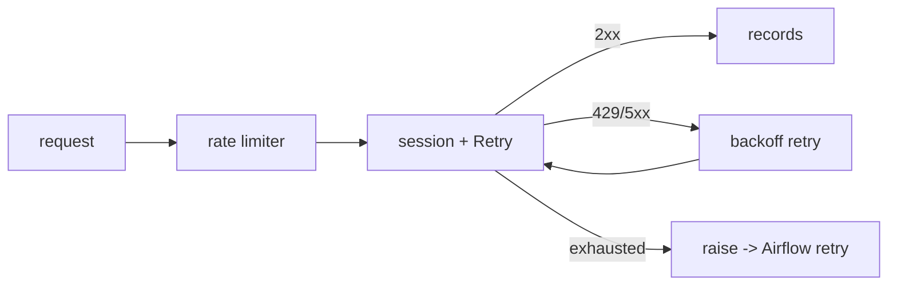

# 04 - API Ingestion Design

> **Phase 8 - Data Ingestion** · Document 04 of 17

## Purpose

Design ingestion from external REST APIs: pagination, rate limiting, retry/backoff, caching, and failure fallback. Implemented in [`ingestion/api/`](../../ingestion/api/) on the shared resilient client [`common/http.py`](../../ingestion/common/http.py).

## Sources (MVP + supporting)

| Connector | Source | Auth | Verified |
| --- | --- | --- | --- |
| `FirmsConnector` | NASA FIRMS / VIIRS | `FIRMS_MAP_KEY` | ✅ pre-flight |
| `PowerConnector` | NASA POWER | anonymous | ✅ |
| `SwpcConnector` | NOAA SWPC | anonymous | ✅ |
| `CelestrakConnector` | CelesTrak GP/TLE | anonymous | ✅ |
| `GfwConnector` | Global Fishing Watch (vessel identity) | `GFW_API_TOKEN` | ✅ live |
| `SentinelHubConnector` | Sentinel Hub Catalog (STAC scene metadata) | OAuth2 (`SENTINELHUB_CLIENT_ID`/`SECRET`) | ⚠️ implemented; OAuth host read-timeout from current network |

All credentials are resolved from settings — never hard-coded. Access prerequisites are catalogued in [docs/source-data-analysis/14-references.md](../source-data-analysis/14-references.md) and verified by [tools/datasource-preflight](../../tools/datasource-preflight/).

## Connector Contract

Every connector extends [`ApiConnector`](../../ingestion/api/base.py):

```text
fetch_raw(**kwargs) -> (records, fmt)
ingest(**kwargs)    -> list[BronzeEnvelope]   # wraps records with provenance
```

This separation keeps connectors free of Kafka/MinIO concerns and unit-testable with a mocked HTTP client (see [tests/test_api_connectors.py](../../ingestion/tests/test_api_connectors.py)).

## Cross-cutting Concerns

| Concern | Strategy |
| --- | --- |
| **Rate limiting** | sliding-window `RateLimiter` (calls/sec) per connector |
| **Retry + backoff** | `urllib3.Retry` total=4, exponential backoff, honours `Retry-After` |
| **Timeouts** | 30 s default on every request |
| **Pagination** | connector-specific; cursor/offset loop inside `fetch_raw` (FIRMS/POWER are single-window pulls) |
| **Caching** | conditional requests / last-pulled watermark (future); Bronze checksum dedup prevents reprocessing |
| **Fallback** | on exhaustion, raise → Airflow retry/backoff; partial batches still land in Bronze |



## Cross References

- [03-batch-design.md](03-batch-design.md) · [10-error-handling.md](10-error-handling.md) · [14-security.md](14-security.md)
