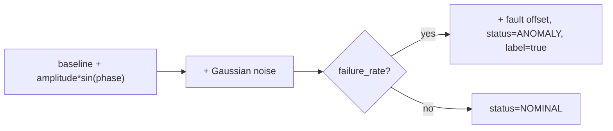

# 06 - Synthetic Data Generation System

> **Phase 8 - Data Ingestion** · Document 06 of 17

## Purpose

Design the simulation system that produces synthetic telemetry, orbit positions, and space-weather events. Implemented in [`ingestion/simulation/`](../../ingestion/simulation/).

## Why Synthetic Data Is Needed

| Reason | Detail |
| --- | --- |
| **Continuous high-rate streams** | Public telemetry feeds are sparse and rate-limited; we need volume to exercise Kafka, back-pressure, and consumer scaling. |
| **Labelled anomalies** | Real feeds lack ground-truth fault labels; the generator injects labelled failures for ML anomaly detection. |
| **Reproducibility** | Seeded generators give deterministic demos and tests. |
| **No credentials / offline** | Works on any laptop with no external dependency. |

## Generators

| Generator | Output | Realism strategy |
| --- | --- | --- |
| `TelemetryGenerator` | per-sensor bus/payload readings | sinusoidal physics + Gaussian noise + fault signatures |
| `OrbitSimulator` | lat/lon/alt ground tracks | SGP4 propagation of real TLEs (analytic fallback) |
| `SpaceWeatherGenerator` | Kp index + flare class | realistic class distribution (X-class rare) |

## Telemetry Model

| Parameter | Default | Purpose |
| --- | --- | --- |
| `interval_s` | 1.0 | sample cadence |
| `seed` | 42 | reproducibility |
| `failure_rate` | 0.002 | anomaly injection probability |
| `start_time` | now | fixable for deterministic tests |

Sensors: battery voltage/temp, solar panel current, reaction-wheel RPM, payload temp, downlink SNR.

## Orbit Model

- Propagates real TLEs (ISS + sample sats) with **SGP4** when `sgp4` is installed.
- Converts ECI → geodetic (lat/lon/alt) using an approximate GMST rotation.
- **Analytic circular-LEO fallback** keeps demos/tests running without the dependency.

## Noise & Failure Injection

- Gaussian sensor noise (`noise_sigma`) per sensor.
- Fault = amplitude × U(2.5, 5.0) offset, flagged `status=ANOMALY` and `metadata.label_anomaly=true` for supervised training.

## Frequency of Generation

| Stream | Cadence |
| --- | --- |
| Telemetry | configurable (default 1 Hz/sat, demo bursts) |
| Orbit | every 10–30 s |
| Space weather | every 60 s |

## Cross References

- [02-streaming-design.md](02-streaming-design.md) · [09-data-quality.md](09-data-quality.md)
