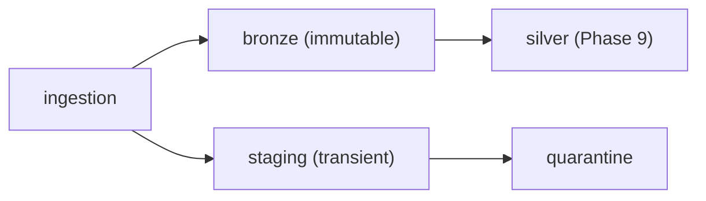

# 07 - Data Landing Zone Architecture

> **Phase 8 - Data Ingestion** · Document 07 of 17

## Purpose

Define the ingestion landing zones in MinIO, their bucket/folder structure, and retention. Implemented in [`ingestion/common/minio_io.py`](../../ingestion/common/minio_io.py).

## Zones

| Zone | Bucket | Content | Mutability |
| --- | --- | --- | --- |
| Raw / Bronze | `bronze` | source-shaped records wrapped in the Bronze envelope | append-only, immutable |
| Staging | `staging` | quarantine, work-in-progress, temp pulls | transient |
| Processed (handoff) | `silver` (Phase 9) | validated/standardised | managed by transformation layer |

Buckets are created by [infrastructure bootstrap](../../infrastructure/scripts/bootstrap.sh) (`bronze`, `staging`, `silver`, `gold`, …).

## Bronze Folder Hierarchy

```
s3://bronze/
  <source>/
    ingest_date=YYYY-MM-DD/
      <batch_id>/
        part-0000.jsonl        # newline-delimited Bronze envelopes
```

Quarantine lands under `s3://staging/quarantine/<source>/ingest_date=.../<batch>.jsonl`.

## Object Key Builder

`bronze_key(source, batch_id, part)` → `"<source>/ingest_date=<UTC date>/<batch_id>/<part>.jsonl"` — a Hive-style `ingest_date` partition so downstream engines (Spark/DuckDB) can prune by date.

## Retention Rules

| Zone | Retention | Rationale |
| --- | --- | --- |
| Bronze | long-term (immutable) | audit, full replay of Silver/Gold |
| Staging | short (e.g. 7–30 days) | transient; quarantine reviewed then cleared |
| Quarantine | medium | enough to inspect, fix, and replay |



## Cross References

- [docs/data-modeling/02-bronze-layer.md](../data-modeling/02-bronze-layer.md) · [05-file-ingestion.md](05-file-ingestion.md) · [09-data-quality.md](09-data-quality.md)
