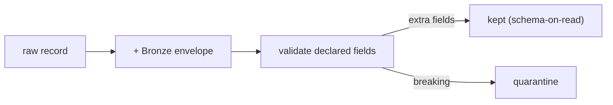

# 08 - Schema Strategy

> **Phase 8 - Data Ingestion** · Document 08 of 17

## Purpose

Define schema handling at ingestion: schema-on-read vs write, a lightweight registry, evolution, backward compatibility, and validation. Implemented in [`ingestion/common/schemas.py`](../../ingestion/common/schemas.py) and [`ingestion/common/envelope.py`](../../ingestion/common/envelope.py).

## Schema-on-Read vs Schema-on-Write

| Layer | Approach | Why |
| --- | --- | --- |
| Bronze | **schema-on-read** | preserve raw payload verbatim; never lose data to a schema mismatch |
| Silver+ | schema-on-write (Iceberg) | enforce structure once data is validated |

Ingestion validates *declared* fields but **allows unknown fields**, so new source attributes never break the pipeline.

## Lightweight Schema Registry

A full registry (e.g. Confluent) is unnecessary on a 16 GB laptop. Instead, declarative `Schema`/`FieldSpec` objects live in code with required-field, type, and range constraints:

| Schema | Key constraints |
| --- | --- |
| `satellite_telemetry` v1 | required: timestamp, satellite_id, sensor_type, payload |
| `orbit_position` v1 | lat ∈ [-90,90], lon ∈ [-180,180], alt ∈ [0,50000] |
| `firms_fire` v1 | lat/lon bounds, acq_date required |

## Bronze Envelope (write-time provenance)

| Column | Purpose |
| --- | --- |
| `_ingest_id` | unique record id |
| `_source` | dataset code |
| `_ingest_ts` / `_event_ts` | arrival / source event time |
| `_batch_id` | ingestion run id |
| `_format` | json/csv/… |
| `_checksum` | SHA-256 (dedup + integrity) |
| `payload` | raw record as-is |

## Schema Evolution & Backward Compatibility

| Change | Handling |
| --- | --- |
| Add field | allowed (additive, schema-on-read) |
| Rename field | both old/new tolerated during transition; Silver maps |
| Type change | flagged at validation; routed to quarantine if breaking |
| Version bump | `Schema.version` increments; multiple versions co-exist |

## Cross References

- [09-data-quality.md](09-data-quality.md) · [architecture/06-data-architecture.md](../../architecture/06-data-architecture.md)
