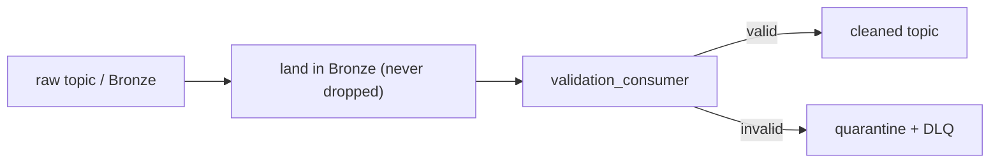

# 09 - Data Quality at Ingestion

> **Phase 8 - Data Ingestion** · Document 09 of 17

## Purpose

Define ingestion-time validation rules, where they run, and how failures are handled. Implemented in [`ingestion/quality/`](../../ingestion/quality/).

## Validation Rules

| Family | Rule | Module |
| --- | --- | --- |
| Schema | required fields, types, ranges | `validators.validate_record` + `schemas` |
| Null checks | required values non-null | `FieldSpec.required` |
| Range validation | numeric bounds (e.g. Kp 0–9, alt) | `FieldSpec.validator` |
| Duplicate detection | checksum seen-in-window | `DuplicateTracker` |
| Timestamp validation | ISO-8601 parseable, not absurdly future/old | `_check_timestamp` |
| Geospatial | lat ∈ [-90,90], lon ∈ [-180,180] | `_check_geo` |

## Where Validation Happens

Validation runs **after** durable Bronze landing and **before** promotion to `cleaned`. This guarantees no data loss even when a record is malformed.

## Failure Handling

| Outcome | Action |
| --- | --- |
| valid | emit to `telemetry.satellite.cleaned` |
| invalid | `Quarantine.send` → DLQ topic + `staging/quarantine/...` with failing rule reasons |
| duplicate | dropped from cleaned stream, logged (already landed once) |

## Quarantine (bad data handling)

`Quarantine` annotates each rejected record with its `reasons` and `_quarantined_at`, then routes to the Kafka DLQ and/or staging bucket for later inspection and **replay** — bad data is never silently discarded.

## Quality Metrics (exposed to observability)

- valid vs invalid counts per stream
- rule-hit breakdown (which rules fire most)
- duplicate ratio

## Cross References

- [10-error-handling.md](10-error-handling.md) · [11-observability.md](11-observability.md) · [08-schema-strategy.md](08-schema-strategy.md)
