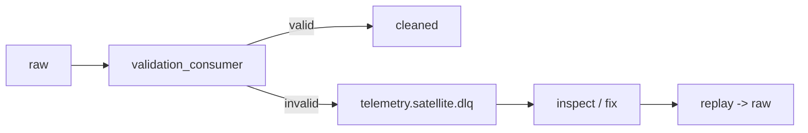

# 10 - Error Handling Strategy

> **Phase 8 - Data Ingestion** · Document 10 of 17

## Purpose

Define retry, dead-letter, fallback, and recovery strategies across the ingestion layer.

## Mechanisms by Layer

| Layer | Mechanism |
| --- | --- |
| API (HTTP) | `urllib3.Retry` total=4, exponential backoff, honour `Retry-After`, 30 s timeout |
| Kafka consumer | manual offset commit; on handler error, no commit → re-delivery |
| Kafka DLQ | `telemetry.satellite.dlq` for records failing validation repeatedly |
| Airflow task | retries=3, exponential backoff to 30 min |
| File loader | per-file isolation; one bad file does not fail the batch |

## Dead Letter Queue (DLQ)

DLQ messages carry `{reasons, record, _quarantined_at}` for triage.

## API Ingestion Fallback

1. Retry with backoff (transient 429/5xx).
2. On exhaustion → raise → Airflow retry/backoff.
3. Partial batches already pulled still land in Bronze (no all-or-nothing loss).
4. Bronze checksum dedup prevents double-ingestion on replay.

## Partial Ingestion Recovery

- Bronze is append-only and `batch_id`-tagged → re-running a failed DAG is safe.
- Idempotent producers (`enable_idempotence`) avoid duplicate Kafka writes on retry.
- At-least-once + checksum dedup converges to effectively-once at Bronze.

## Cross References

- [02-streaming-design.md](02-streaming-design.md) · [04-api-ingestion.md](04-api-ingestion.md) · [09-data-quality.md](09-data-quality.md)
