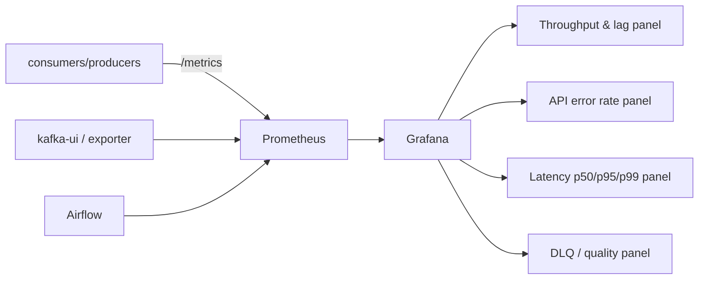

# 11 - Observability for the Ingestion Layer

> **Phase 8 - Data Ingestion** · Document 11 of 17

## Purpose

Define monitoring for ingestion: Kafka lag, consumer throughput, API failures, DAG outcomes, and latency. Aligns with [architecture/08-observability-architecture.md](../../architecture/08-observability-architecture.md) (Prometheus + Grafana + OTel).

## What to Monitor

| Signal | Source | Metric (concept) |
| --- | --- | --- |
| Kafka consumer lag | Kafka / consumer | `kafka_consumergroup_lag` |
| Consumer throughput | consumers | `ingestion_records_total` (counter) |
| API ingestion failures | connectors | `ingestion_api_errors_total{source}` |
| Airflow DAG success/failure | Airflow | task state, `dag_run` duration |
| Ingestion latency | producer→Bronze | `ingestion_latency_seconds` (histogram) |
| Quality | validation consumer | `ingestion_invalid_total{rule}` |

## Prometheus Metrics Mapping

| Metric | Type | Labels |
| --- | --- | --- |
| `ingestion_records_total` | counter | source, stage |
| `ingestion_latency_seconds` | histogram | source |
| `ingestion_api_errors_total` | counter | source, code |
| `ingestion_invalid_total` | counter | source, rule |
| `kafka_consumergroup_lag` | gauge | group, topic, partition |

## Grafana Dashboard Concepts

Panels: ingestion throughput, consumer lag per topic, API error rate by source, end-to-end latency percentiles, DLQ rate and rule breakdown, DAG success ratio.

## Cross References

- [12-latency.md](12-latency.md) · [10-error-handling.md](10-error-handling.md)
