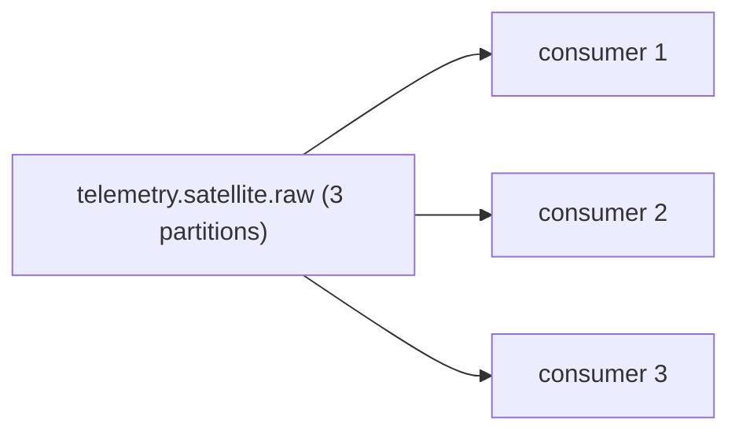

# 13 - Scalability Design

> **Phase 8 - Data Ingestion** · Document 13 of 17

## Purpose

Explain how the ingestion layer scales: Kafka consumers, Airflow workers, more satellite streams, and burst events.

## Scaling Kafka Consumers

- Partition count (default 3) sets the max parallelism of a consumer group.
- Add consumer instances in the same group → partitions rebalance across them.
- Key = `satellite_id` keeps per-satellite ordering while spreading load.

To grow beyond 3, increase partitions (one-way) before adding consumers.

## Scaling Airflow Workers

- LocalExecutor (laptop) → CeleryExecutor/KubernetesExecutor (cluster) for parallel tasks.
- DAGs are independent and idempotent, so horizontal worker scaling is safe.

## Handling Increasing Satellite Streams

- Add satellites to the generator fleet; throughput scales with partitions + consumers.
- Bronze `ingest_date` partitioning bounds per-object size as volume grows.

## Handling Burst Ingestion (e.g. launch events)

| Tactic | Effect |
| --- | --- |
| Kafka buffering | absorbs spikes; consumers drain at their own rate |
| Back-pressure via lag | monitored; autoscale signal |
| Larger `max_poll_records` | higher per-poll batch under load |
| Decouple raw vs validation | raw writer never blocked by validation |

## Constraints (16 GB laptop)

Single Kafka broker (repl=1), LocalExecutor, capped container memory. Designed to scale **out** by lifting these single-node limits, not to require them.

## Cross References

- [12-latency.md](12-latency.md) · [architecture/11-scalability-design.md](../../architecture/11-scalability-design.md)
