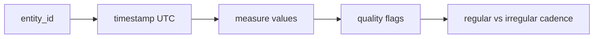

# 03 Data Structure Analysis

## Executive Summary

The 45 datasets resolve into a small number of recurring structural archetypes. Recognizing these archetypes lets the ingestion layer reuse a few canonical handling patterns rather than bespoke logic per source. This document analyzes field-level structure, common schema patterns, and the four dominant data shapes: time-series, geospatial, event-based, and hierarchical.

## Structural Archetypes

| Archetype | Example Sources | Key Shape | Canonical Keys |
| --- | --- | --- | --- |
| Time-series | SWPC, GOES, NASA POWER, ERA5, telemetry | Ordered samples by timestamp | `timestamp`, `value`, `entity_id` |
| Geospatial point | FIRMS, VIIRS, GFW, OpenAQ, AIS | Lat/lon-tagged records | `lat`, `lon`, `time`, `attributes` |
| Geospatial raster | Sentinel, Landsat, MODIS, CAMS | Gridded scenes/tiles | `tile_id`, `bbox`, `bands`, `acq_time` |
| Event-based | DONKI, launches, EMS, NeoWs | Discrete records with start/end | `event_id`, `type`, `start`, `end` |
| Hierarchical | TLE/GP, OEM, JPL bodies | Nested object catalogs | `object_id`, parent/child links |

## Field-Level Patterns

- **Identity:** every source carries a stable key (`norad_id`, `scene_id`, `mmsi`, `event_id`, `station_id`).
- **Temporal:** timestamps appear in ISO-8601, Unix epoch, or domain epoch (TLE day-of-year) — normalization to UTC ISO-8601 is mandatory.
- **Spatial:** point (lat/lon), bbox, or footprint geometry (GeoJSON/WKT).
- **Measure:** numeric value plus unit, often with quality/confidence flags.
- **Provenance:** satellite/sensor/source fields enable lineage.

## Time-Series Structure

Cadence varies from sub-second (telemetry) to 3-hourly (Kp) to daily (POWER). Irregular event streams require resampling before model training.

## Geospatial Structure

- Points need only `lat/lon`; rasters need projection, resolution, and band metadata.
- All sources must align to EPSG:4326 for the conceptual layer; rasters may carry UTM internally.
- Footprints stored as GeoJSON polygons for indexing.

## Event-Based Structure

Events carry `start`, optional `end`, `type`, `severity`, and `geometry`. Used for launches, flares, EMS activations, and anomalies; ideal for join keys against time-series windows.

## Hierarchical Structure

TLE/GP and ephemerides describe objects with derived state vectors; catalogs nest object → epoch → element set. Astronomical bodies nest body → orbit → observation.

## Cross References

- Profiling: [02-dataset-profiling.md](./02-dataset-profiling.md)
- Quality: [04-data-quality-assessment.md](./04-data-quality-assessment.md)
