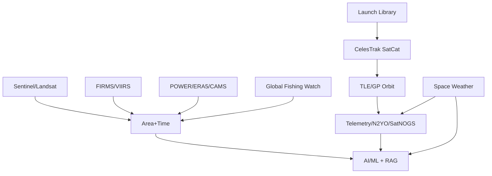

# 07 Data Relationships

## Executive Summary

Datasets are not independent; they interrelate through satellites, locations, time windows, and events. Understanding these links enables enrichment and cross-source feature engineering.

## Conceptual Relationships

- **Satellite ↔ telemetry ↔ orbit:** NORAD ID links TLE, telemetry, and pass predictions.
- **Launch ↔ satellite deployment:** launch records seed catalog objects.
- **Space weather ↔ satellite anomalies:** geomagnetic indices correlate with telemetry faults.
- **Earth observation ↔ climate:** imagery joins with weather/climate by AOI and time.
- **Fire ↔ imagery ↔ weather:** FIRMS points joined to Sentinel scenes and POWER conditions.

## Relationship Graph

## Join Keys

| Relationship | Key | Tolerance |
| --- | --- | --- |
| Imagery ↔ fire | bbox + time | scene window |
| Imagery ↔ weather | lat/lon + day | 1 day |
| Telemetry ↔ orbit | norad_id | exact |
| Weather ↔ anomaly | time | hour |

## Cross References

- Structure: [03-data-structure-analysis.md](./03-data-structure-analysis.md)
- Freshness: [08-freshness-strategy.md](./08-freshness-strategy.md)
