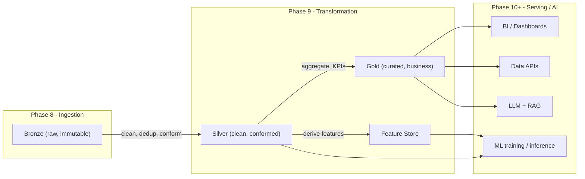

# 01 - Transformation Layer Overview

> **Phase 9 - Data Transformation** · Document 01 of 19

## Purpose

The transformation layer converts raw ingested data into clean, structured, analytics- and AI-ready datasets. It is the processing core of the lakehouse, sitting between **ingestion (Phase 8)** and the **serving/AI layers (Phase 10+)**.

> Raw ingestion data → clean structured data → analytics + AI-ready datasets

## Position in the Lakehouse

## Medallion Role (Bronze → Silver → Gold)

| Layer | Owner | Guarantee | Engine |
| --- | --- | --- | --- |
| Bronze | Ingestion | Raw, immutable, replayable | Kafka/Airflow writers |
| Silver | Transformation | Cleaned, typed, deduplicated, conformed | Spark (batch + streaming) |
| Gold | Transformation | Aggregated, business KPIs, dashboard-shaped | dbt (SQL) on Silver |
| Features | Transformation | Reusable ML features keyed by (entity, ts) | Spark + pure-Python rules |

## Batch vs Streaming Strategy

| Path | Use | Latency | Code |
| --- | --- | --- | --- |
| Streaming | telemetry, orbit, space weather near-real-time rollups | seconds | [transformation/streaming/](../../transformation/streaming/spark_streaming.py) |
| Batch | daily Silver conformance, Gold marts, features, backfills | minutes → daily | [transformation/batch/](../../transformation/batch/) |

Both paths reuse the **same pure-Python transformation rules**, so streaming and batch produce identical semantics (no logic drift).

## Design Principles

- Open-source only; fits a 16 GB laptop (Spark `local[*]`, DuckDB warehouse, single Airflow LocalExecutor).
- Pure-Python rule core is infra-free and fully unit-tested — runs with no Java/Spark.
- Silver is the single source of truth for clean data; Gold never reads Bronze directly.
- Every run emits lineage; nothing is silently dropped (rejects → quarantine).

## Component → Code Map

| Concern | Module |
| --- | --- |
| Settings | [transformation/config/settings.py](../../transformation/config/settings.py) |
| Spark session | [transformation/common/spark.py](../../transformation/common/spark.py) |
| Cleaning rules | [transformation/cleaning/cleaning_rules.py](../../transformation/cleaning/cleaning_rules.py) |
| Bronze→Silver | [transformation/batch/bronze_to_silver.py](../../transformation/batch/bronze_to_silver.py) |
| Silver→Gold | [transformation/batch/silver_to_gold.py](../../transformation/batch/silver_to_gold.py) |
| Features | [transformation/features/feature_engineering.py](../../transformation/features/feature_engineering.py) |
| Streaming | [transformation/streaming/spark_streaming.py](../../transformation/streaming/spark_streaming.py) |
| Orchestration | [transformation/orchestration/dags/](../../transformation/orchestration/dags/transformation_pipeline_dag.py) |
| dbt Gold | [transformation/dbt/](../../transformation/dbt/) |

## Cross References

- [02-processing-engines.md](02-processing-engines.md) · [03-bronze-silver.md](03-bronze-silver.md) · [architecture/06-data-architecture.md](../../architecture/06-data-architecture.md)
