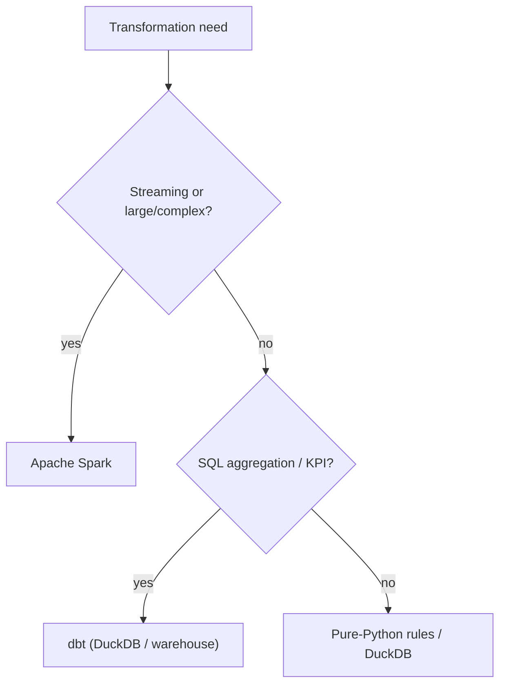

# 02 - Processing Engine Design

> **Phase 9 - Data Transformation** · Document 02 of 19

## Engine Responsibilities

| Engine | Role | Where it runs |
| --- | --- | --- |
| **Apache Spark** | Core distributed engine: Bronze→Silver cleaning/conformance, large joins, structured streaming | `local[*]` on laptop; cluster in prod |
| **dbt** | SQL analytics-engineering: Silver→Gold marts, KPI tables, tests, lineage | DuckDB locally; Trino/Spark-SQL in prod |
| **DuckDB** | Lightweight in-process SQL fallback for small/medium marts and ad-hoc work | embedded |
| **Pure-Python rules** | Canonical transformation logic, infra-free + unit-tested; reused by Spark UDFs | everywhere |

## Why Spark (core engine)

- Handles both **batch** and **structured streaming** with one API → no second framework.
- Scales from a laptop (`local[*]`) to a cluster without code change.
- Rich connectors: Kafka, S3A/MinIO, Parquet/Iceberg.
- Mature windowing, watermarking, and stateful aggregation for streaming.

## When dbt is used

- All **Silver → Gold** SQL modelling (marts, KPI tables).
- Declarative tests (`not_null`, `unique`, `accepted_range`) as quality gates.
- Automatic **lineage** graph (source → staging → gold).
- Analysts contribute SQL without touching Spark/Python.

## When lightweight processing is sufficient (DuckDB)

- Datasets that fit in memory (most Gold marts on this platform).
- Local development and CI where spinning up Spark is overkill.
- Reading Silver Parquet directly with zero running server.

## Decision Flow

## Engine Boundaries (avoiding overlap)

| Concern | Spark | dbt | Rationale |
| --- | --- | --- | --- |
| Cleaning, dedup, schema conformance | ✅ | ❌ | row-level, scale, streaming |
| Aggregations, KPIs, marts | ❌ | ✅ | declarative SQL, testable |
| Feature engineering | ✅ | ❌ | windowed, reused in serving |
| Quality tests on Gold | ❌ | ✅ | dbt tests in CI/DAG |

## Cross References

- [03-bronze-silver.md](03-bronze-silver.md) · [04-silver-gold.md](04-silver-gold.md) · [17-trade-offs.md](17-trade-offs.md) · [18-adr.md](18-adr.md)
