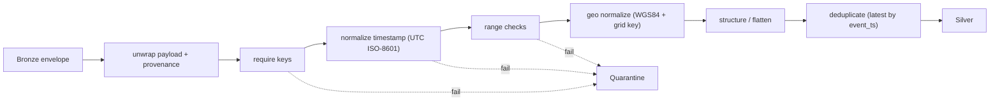

# 03 - Bronze → Silver Transformation Design

> **Phase 9 - Data Transformation** · Document 03 of 19

## Purpose

Silver is the first layer where data is **guaranteed clean**: typed, range-checked, timestamp-normalized, geospatially normalized, deduplicated, and conformed to the Phase 6 contract ([docs/data-modeling/03-silver-layer.md](../data-modeling/03-silver-layer.md)). Bronze stays raw and immutable.

## Transformation Flow

## Standard Silver Processing Steps

| Step | Rule | Code |
| --- | --- | --- |
| Schema standardization | flatten nested payload to typed columns | `clean_telemetry` |
| Data cleaning | coerce types, correct units/casing | [cleaning_rules.py](../../transformation/cleaning/cleaning_rules.py) |
| Deduplication | window by natural key, keep latest `event_ts` | `deduplicate()` |
| Timestamp normalization | parse → UTC ISO-8601; reject unparseable | `normalize_timestamp()` |
| Geospatial normalization | clamp lat, wrap lon, snap to 0.25° grid, add `geo_key` | `normalize_position()` |
| Telemetry structuring | `sensor.value/unit/status` → flat columns + anomaly count | `clean_telemetry` |

## Transformation Rules — Satellite Telemetry

| Rule | Action |
| --- | --- |
| Required keys | `timestamp`, `satellite_id` → else reject `null:*` |
| Timestamp | normalize to UTC; unparseable → reject |
| Flatten | `battery_voltage:{value,unit,status}` → `battery_voltage_value/_unit/_status` |
| Health/label | lift `metadata.health`, `metadata.label_anomaly` |
| Anomaly count | count sensors with `status == ANOMALY` |
| Dedup key | `(satellite_id, event_ts)` |

## Transformation Rules — Orbit Data

| Rule | Action |
| --- | --- |
| Required keys | `timestamp`, `satellite_id`, `latitude`, `longitude` |
| Ranges | lat ∈ [-90, 90], lon ∈ [-180, 180], alt ∈ [0, 50000] km → else reject |
| Geo normalize | clamp/wrap, snap to grid, add `grid_lat/lon`, `geo_key` |
| Dedup key | `(satellite_id, event_ts)` |

## Transformation Rules — Space Weather

| Rule | Action |
| --- | --- |
| Required keys | `timestamp`, `kp_index` |
| Range | `kp_index` ∈ [0, 9] → else reject |
| Derive | `flare_letter` from `flare_class`; recompute `geomagnetic_storm = kp >= 5` |
| Dedup key | `(event_ts, event_type)` |

## Quarantine

Rejected records are written to the quarantine dataset with `_entity`, `_reasons`, and the original `payload` for reconciliation (see [12-data-quality.md](12-data-quality.md), [15-error-handling.md](15-error-handling.md)).

## Cross References

- [transformation/batch/bronze-to-silver.md](../../transformation/batch/bronze-to-silver.md) · [07-cleaning-framework.md](07-cleaning-framework.md) · [10-geospatial.md](10-geospatial.md)
