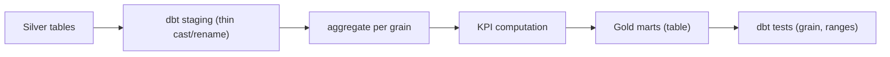

# 04 - Silver → Gold Transformation Design

> **Phase 9 - Data Transformation** · Document 04 of 19

## Purpose

Gold is curated, business-ready analytics: aggregates, KPIs, and dashboard-shaped wide tables built from Silver. Gold avoids runtime joins and is the contract for BI, APIs, and RAG. Aligns with [docs/data-modeling/04-gold-layer.md](../data-modeling/04-gold-layer.md).

## Flow

## Gold Datasets

### 1. Satellite Health Analytics — `fact_sat_health`
Grain: **1 row / satellite / day**.

| Metric | Definition |
| --- | --- |
| `health_score` | `mean(health_weight) × (1 − 0.5 × anomaly_density)`, weights NOMINAL=1, UNKNOWN=0.5, ANOMALY=0 |
| `anomaly_density` | anomaly samples ÷ total samples |
| `labelled_anomalies` | count of `label_anomaly = true` |
| `battery_voltage_drift` | max − min battery voltage in day |

Code: `gold_satellite_health` · dbt: [fact_sat_health.sql](../../transformation/dbt/models/gold/fact_sat_health.sql)

### 2. Launch Performance Analytics — `kpi_launch_monthly`
Grain: **1 row / provider / month**.

| Metric | Definition |
| --- | --- |
| `success_rate` | successes ÷ launches |
| `cadence_per_month` | launches in month |
| `mean_delay_days` | mean schedule slip |

Code: `gold_launch_performance`

### 3. Space Weather Impact Analytics — `fact_weather_impact`
Grain: **1 row / day**.

| Metric | Definition |
| --- | --- |
| `max_kp_index` / `mean_kp_index` | daily geomagnetic activity |
| `storm_events` | count of `geomagnetic_storm` |
| `anomaly_rate` | telemetry anomaly samples ÷ total |

Joins weather and telemetry on calendar day to expose **storm → anomaly** correlation. Code: `gold_space_weather_impact` · dbt: [fact_weather_impact.sql](../../transformation/dbt/models/gold/fact_weather_impact.sql)

### 4. Earth Observation Analytics — `kpi_eo_daily`
Grain: **1 row / geo grid cell / day**.

| Metric | Definition |
| --- | --- |
| `detections` | fire detections in cell/day |
| `mean_frp` / `median_frp` / `max_frp` | fire radiative power stats |

Code: `gold_earth_observation`

## KPI Consistency

The pure-Python Gold functions and the dbt SQL implement the **same KPI definitions** so dashboards and ad-hoc Python agree. dbt tests enforce grain uniqueness and value ranges.

## Cross References

- [transformation/batch/silver-to-gold.md](../../transformation/batch/silver-to-gold.md) · [09-aggregation.md](09-aggregation.md) · [data-modeling/05-star-schemas.md](../data-modeling/05-star-schemas.md)
