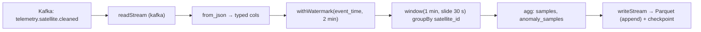

# 05 - Streaming Transformation Design

> **Phase 9 - Data Transformation** · Document 05 of 19

## Purpose

Near-real-time Silver enrichment of cleaned ingestion topics using Spark Structured Streaming. Targets second-scale rollups (e.g. per-satellite anomaly counts per minute) without a separate streaming framework.

## Pipeline

Code: [transformation/streaming/spark_streaming.py](../../transformation/streaming/spark_streaming.py)

## Micro-batch Processing

- Trigger: `processingTime = 30 s` — each micro-batch processes newly-arrived events.
- Append output mode emits finalized windows once the watermark passes their end.
- Checkpointing to `SPARK_CHECKPOINT_DIR` gives exactly-once state recovery.

## Windowing Strategy

| Parameter | Value | Reason |
| --- | --- | --- |
| window duration | 1 minute | dashboard granularity for live health |
| slide duration | 30 seconds | overlapping windows → smoother trend |
| watermark delay | 2 minutes | bound late telemetry without unbounded state |

See [windowing-strategy.md](../../transformation/streaming/windowing-strategy.md) and [transformation/streaming/windowing-strategy.md].

## Late Data Handling

- Events later than the watermark are **dropped from windowed state** (logged to metrics) — they remain available in Bronze for batch reprocessing.
- The batch path (Phase 9 batch) is the **correctness backstop**: it reprocesses the full day and overwrites the streaming approximation in Gold.

## Watermark Strategy (conceptual)

Watermark = `max(event_time) − 2 min`. State for a window is retained until the watermark passes `window.end`, then the result is emitted and state evicted. This bounds memory on a 16 GB laptop.

## Streaming vs Batch Reconciliation

Streaming produces **low-latency approximate** rollups; the nightly batch produces the **authoritative** version. Gold marts mark provenance (`source = stream|batch`) so dashboards can prefer batch once available.

## Cross References

- [06-batch-processing.md](06-batch-processing.md) · [15-error-handling.md](15-error-handling.md) · [17-trade-offs.md](17-trade-offs.md)
