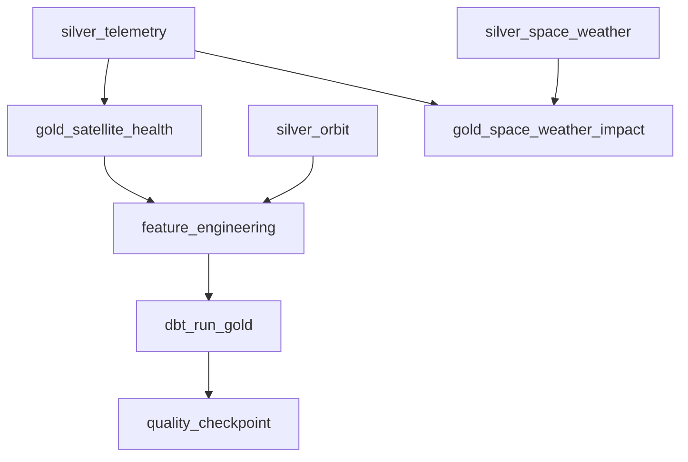

# 06 - Batch Transformation Design

> **Phase 9 - Data Transformation** · Document 06 of 19

## Purpose

Batch workflows produce the authoritative Silver, Gold, and feature datasets, run backfills, and reconcile streaming approximations. Orchestrated by Airflow.

## DAG

Code: [transformation/orchestration/dags/transformation_pipeline_dag.py](../../transformation/orchestration/dags/transformation_pipeline_dag.py)

## Schedule

| Job | Cadence | Trigger |
| --- | --- | --- |
| Silver conformance | daily 01:00 UTC (or hourly micro-batch) | schedule |
| Gold marts (dbt) | daily after Silver | dependency |
| Feature engineering | daily after Silver | dependency |
| Backfill / reprocess | on demand | manual / data fix |

## Incremental Processing

- Silver jobs read only the execution-date partition of Bronze (`--date {{ ds }}`).
- Gold dbt models are incremental where natural (append daily grain), full-refresh for small marts.
- Idempotency: Silver output is overwritten per partition; dedup keeps the run deterministic.

## Full Reprocessing Strategy

Because **Bronze is immutable and replayable**, any Silver/Gold table can be rebuilt from scratch by replaying Bronze through the same rule code — guaranteeing reproducibility (see [13-lineage.md](13-lineage.md)).

## Dependency Chaining

Airflow enforces ordering; `retries=2`, `retry_delay=5m`, `max_active_runs=1` to protect a laptop. A failed Silver task blocks its dependent Gold/feature tasks (see [15-error-handling.md](15-error-handling.md)).

## Cross References

- [05-streaming-processing.md](05-streaming-processing.md) · [transformation/batch/](../../transformation/batch/) · [ingestion/03-batch-design.md](../ingestion/03-batch-design.md)
