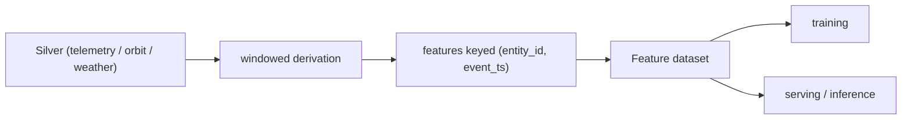

# 08 - Feature Engineering Design

> **Phase 9 - Data Transformation** · Document 08 of 19

## Purpose

Derive reusable ML features from **Silver** (not Bronze), so features inherit cleaning + dedup and are deterministic for both training and serving (no train/serve skew). Features are written to a feature dataset keyed by `(entity_id, event_ts, feature_namespace)`.

## Feature Derivation Strategy

Code: [transformation/features/feature_engineering.py](../../transformation/features/feature_engineering.py)

## Feature Families

### Satellite Health
| Feature | Derivation |
| --- | --- |
| `signal_stability` | `1 / (1 + stddev(SNR over window))` |
| `sensor_drift` | trailing change in rolling-mean battery voltage |
| `anomaly_indicator` | 1 if any sensor `status = ANOMALY` |

### Orbit Analytics
| Feature | Derivation |
| --- | --- |
| `orbit_deviation` | |altitude − rolling-mean altitude| |
| `velocity_variance` | trailing variance of ground speed |
| `trajectory_stability` | `1 / (1 + velocity_variance)` |
| `ground_speed_kmps` | great-circle distance ÷ Δt |

### Space Weather
| Feature | Derivation |
| --- | --- |
| `solar_storm_intensity` | `kp_norm × (flare_energy / 5)` |
| `radiation_exposure_index` | `0.6·kp_norm + 0.4·(flare_energy/5)` |

Full table: [transformation/features/feature-definitions.md](../../transformation/features/feature-definitions.md)

## Feature Reuse Strategy

- One physical feature dataset serves multiple models (health scoring, anomaly detection, orbit-decay forecasting).
- Namespacing (`feature_namespace`) prevents collisions and enables selective reads.
- Deterministic, windowed computation means a feature can be recomputed identically for backfill and online inference → eliminates skew.

## Why Features Live in the Transformation Layer

Features are transformations of Silver data; co-locating them with Silver/Gold keeps one lineage graph and one engine, and lets the same Spark job emit Silver + features in a single pass (see [18-adr.md](18-adr.md) ADR-5).

## Cross References

- [data-modeling/08-feature-store.md](../data-modeling/08-feature-store.md) · [11-time-series.md](11-time-series.md) · [architecture/07-ai-ml-architecture.md](../../architecture/07-ai-ml-architecture.md)
