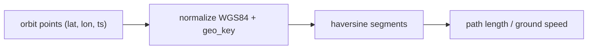

# 10 - Geospatial Transformation Design

> **Phase 9 - Data Transformation** · Document 10 of 19

## Purpose

Normalize coordinates, build spatial keys, reconstruct orbit ground tracks, and prepare spatial joins for the Earth-observation and orbit datasets.

## Coordinate Transformation Strategy

| Step | Rule | Code |
| --- | --- | --- |
| Datum | all coordinates conformed to **WGS84 / EPSG:4326** | (ingestion + Silver) |
| Longitude wrap | wrap into [-180, 180) | `normalize_lon` |
| Latitude clamp | clamp to [-90, 90] | `clamp_lat` |
| Grid snap | round to 0.25° cell | `snap_to_grid` |
| Spatial key | `geo_key = "<grid_lat>:<grid_lon>"` | `geo_key` |

Code: [transformation/geospatial/spatial_transform.py](../../transformation/geospatial/spatial_transform.py)

## Spatial Normalization

A 0.25° grid (~27 km at the equator) keeps marts compact while preserving useful resolution. Every orbit/observation row gets `grid_lat`, `grid_lon`, `geo_key` for deterministic geospatial grouping.

## Orbit Path Reconstruction

Ordered ground-track points are connected with great-circle (haversine) segments to compute path length and ground speed (`reconstruct_path_length_km`, `haversine_km`) — inputs to orbit features (see [08-feature-engineering.md](08-feature-engineering.md)).

## Geospatial Joins (conceptual)

EO observations and orbit footprints join on `geo_key` (grid-cell equality) for the offline/laptop path. At cluster scale, true polygon/point joins use **Spark + Apache Sedona** (H3/geohash indexing) — the `geo_key` design degrades gracefully to that without schema change.

## Cross References

- [transformation/geospatial/spatial-transformation.md](../../transformation/geospatial/spatial-transformation.md) · [data-modeling/07-geospatial-model.md](../data-modeling/07-geospatial-model.md) · [09-aggregation.md](09-aggregation.md)
