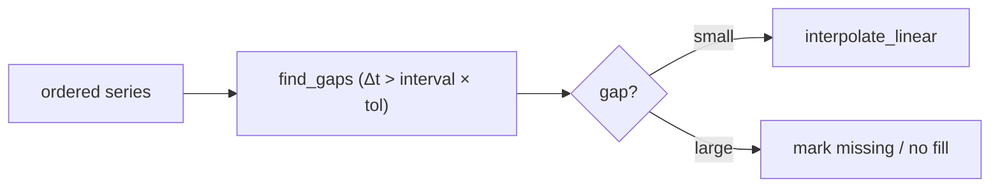

# 11 - Time-Series Processing Design

> **Phase 9 - Data Transformation** · Document 11 of 19

## Purpose

Align, resample, and gap-fill the telemetry/orbit/weather time series so downstream aggregation, features, and anomaly detection operate on regular, complete series.

## Time-Window Alignment

Timestamps are floored to fixed windows (`floor_to_window`, `window_key`) so events from different sensors/satellites align on the same minute/hour/day boundaries. All times are UTC ISO-8601 (normalized in Silver).

Code: [transformation/timeseries/time_series.py](../../transformation/timeseries/time_series.py)

## Resampling Strategy

| Method | Use |
| --- | --- |
| `resample_mean` | down-sample irregular high-rate telemetry to fixed windows (window mean) |
| `rolling_mean` | trailing smoothing for drift/stability features |

## Missing Timestamp Handling

- `find_gaps` detects inter-arrival intervals exceeding `expected_interval × tolerance` and estimates missing sample count.
- Small gaps → `interpolate_linear`. Large gaps are **left as gaps** (flagged) to avoid fabricating data; the anomaly model treats prolonged dropout as signal.

## Anomaly Detection Preprocessing

Regularized, gap-aware series + rolling statistics feed the anomaly features (`signal_stability`, `sensor_drift`) and physical-bound/z-score flags from the cleaning layer. This is the preprocessing contract for the Phase 10+ anomaly model.

## Cross References

- [08-feature-engineering.md](08-feature-engineering.md) · [07-cleaning-framework.md](07-cleaning-framework.md) · [data-modeling/06-time-series-model.md](../data-modeling/06-time-series-model.md)
