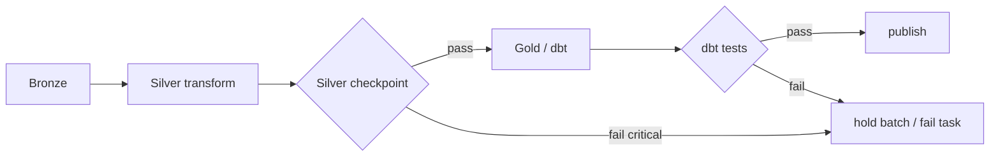

# 12 - Data Quality Enforcement in Transformation

> **Phase 9 - Data Transformation** · Document 12 of 19

## Validation Checkpoints Between Layers

| Checkpoint | Engine | Examples |
| --- | --- | --- |
| Silver | `validation_framework` | not-null keys, unique natural key, value ranges |
| Gold | dbt tests | grain uniqueness, `accepted_range`, not-null |

Code: [transformation/cleaning/validation_framework.py](../../transformation/cleaning/validation_framework.py) · dbt: [_gold.yml](../../transformation/dbt/models/gold/_gold.yml)

## Severity Model

| Severity | Behaviour |
| --- | --- |
| `critical` | failing expectation **blocks** promotion (orchestrator fails the task) |
| `warn` | logged, allows promotion, raises a metric |

## Correction vs Rejection Rules

- **Correct** at the cleaning layer (units, casing, geo wrap, timestamp normalize).
- **Reject** to quarantine when structurally invalid (missing keys, unparseable time, out-of-range physical value), with a machine-readable `reason`.

## Data Reconciliation Strategy

- Row counts reconciled across layers: `rows_in = rows_out + rows_rejected` (captured in lineage).
- Quarantined records are periodically reviewed; fixable issues are corrected at source and replayed from Bronze.
- Streaming vs batch reconciliation: batch is authoritative and overwrites streaming approximations.

## Audit Logging Strategy

Every run writes a `LineageRecord` (run id, inputs/outputs, row counts, rejects, status, timestamps) — the audit trail for quality and reproducibility (see [13-lineage.md](13-lineage.md)).

## Cross References

- [07-cleaning-framework.md](07-cleaning-framework.md) · [transformation/cleaning/validation-framework.md](../../transformation/cleaning/validation-framework.md) · [16-observability.md](16-observability.md)
