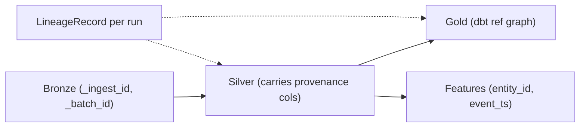

# 13 - Data Lineage Design

> **Phase 9 - Data Transformation** · Document 13 of 19

## Lineage Tracking Strategy

Every transformation run emits a `LineageRecord` capturing inputs, outputs, row counts, code version, run id, and status.

Code: [transformation/common/lineage.py](../../transformation/common/lineage.py)

## Transformation Traceability

- Silver rows carry `_ingest_id` and `_batch_id` from the Bronze envelope, so any clean row traces to its raw origin.
- dbt builds the **source → staging → gold** graph automatically (`dbt docs`), giving column-level lineage for Gold.
- Feature rows are keyed by `(entity_id, event_ts, feature_namespace)` and reference their Silver source.

## Dataset Versioning

| Mechanism | Use |
| --- | --- |
| `code_version` fingerprint | hash of rule identifiers → know which logic produced a row |
| `run_id` | unique per run, sortable by time |
| Bronze immutability | replay any version from raw |
| (prod) Iceberg/Delta snapshots | time-travel + schema evolution |

## Reproducibility Mechanism

Because Bronze is immutable and the transformation rules are deterministic and versioned, **any Silver/Gold/feature dataset can be rebuilt byte-for-byte** by replaying Bronze through the pinned `code_version`. This is the platform's reproducibility guarantee.

## Cross References

- [12-data-quality.md](12-data-quality.md) · [data-modeling/17-adr.md](../data-modeling/17-adr.md) · [architecture/06-data-architecture.md](../../architecture/06-data-architecture.md)
