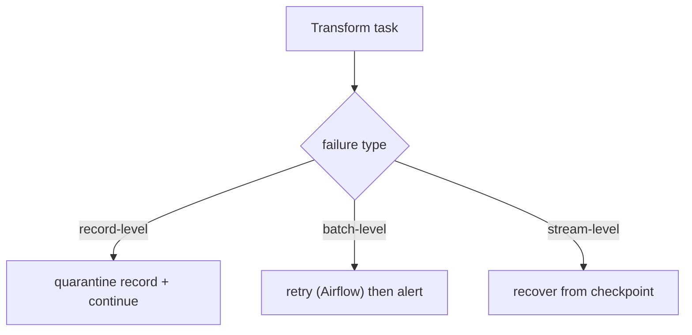

# 15 - Error Handling Strategy

> **Phase 9 - Data Transformation** · Document 15 of 19

## Failure Domains

## Failed Transformation Recovery

| Scope | Strategy |
| --- | --- |
| Record | reject to **quarantine dataset** with reason; batch continues |
| Batch task | Airflow `retries=2`, `retry_delay=5m`; idempotent overwrite per partition |
| Full rebuild | replay Bronze (immutable) through pinned `code_version` |

## Partial Job Retry Strategy

Silver/Gold tasks are **idempotent per date partition**: re-running overwrites that partition deterministically (dedup makes output stable). The DAG retries only failed tasks, not the whole pipeline.

## Checkpointing Strategy

- **Streaming:** Spark checkpoint dir stores offsets + window state → exactly-once recovery after a crash.
- **Batch:** partition-level overwrite acts as a coarse checkpoint; completed partitions are skipped on rerun.

## Dead-Letter / Quarantine Dataset

Rejected rows land in the quarantine dataset (`_entity`, `_reasons`, original `payload`). It is monitored (reject-rate metric), reviewed, and — once the root cause is fixed — replayed from Bronze. Nothing is ever silently dropped.

## Cross References

- [12-data-quality.md](12-data-quality.md) · [16-observability.md](16-observability.md) · [architecture/12-failure-handling.md](../../architecture/12-failure-handling.md)
