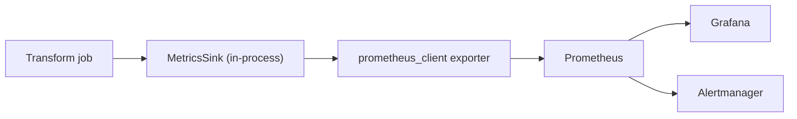

# 16 - Observability of Transformation Layer

> **Phase 9 - Data Transformation** · Document 16 of 19

## What We Monitor

| Signal | Metric | Source |
| --- | --- | --- |
| Job execution status | `transform_job_status{job}` | Airflow / job exit |
| Processing latency | `transform_duration_seconds{job}` | lineage start/finish |
| Data freshness | `transform_data_freshness_seconds{dataset}` | max event_ts vs now |
| Failure / reject rate | `transform_rows_rejected_total{job,layer}` | metrics sink |
| Throughput | `transform_rows_out_total{job,layer}` | metrics sink |
| Rows in | `transform_rows_in_total{job,layer}` | metrics sink |

Code: [transformation/common/metrics.py](../../transformation/common/metrics.py)

## Prometheus Metrics Mapping

Offline runs use the dependency-free `MetricsSink`; under infrastructure the same metric names are exported via `prometheus_client`.

## Grafana Dashboard Concepts

| Panel | Metric(s) |
| --- | --- |
| Pipeline health | job status, last success time |
| Latency | `transform_duration_seconds` per job (p50/p95) |
| Freshness SLA | `transform_data_freshness_seconds` vs threshold |
| Reject rate | `rows_rejected_total / rows_in_total` |
| Throughput | `rows_out_total` rate |

## Alerts

| Alert | Condition |
| --- | --- |
| Stale data | freshness > 2× expected interval |
| High reject rate | rejects/in > 5% over 15 min |
| Job failure | status != success after retries |

## Cross References

- [12-data-quality.md](12-data-quality.md) · [15-error-handling.md](15-error-handling.md) · [architecture/08-observability-architecture.md](../../architecture/08-observability-architecture.md)
