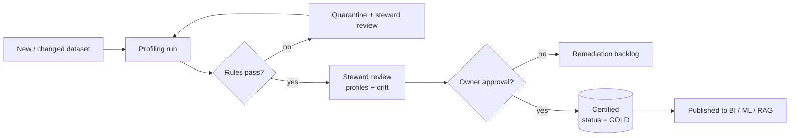

# Data Governance Model

> The operating model that assigns accountability for data quality across the
> Space Mission Data & AI Platform. Roles are lightweight and realistic for a
> small team, but map cleanly to enterprise RACI.

---

## 1. Roles

| Role | Accountable for | Typical person |
|------|-----------------|----------------|
| **Data Owner** | Business fitness of a data domain; approves certification | Domain/product lead |
| **Data Steward** | Quality rules, profiling review, incident triage | Analytics engineer |
| **Platform Engineer** | Pipelines, gates, observability, infra | Data engineer |
| **Data Consumer** | Correct use, reports issues, requests changes | Analyst / ML engineer |

---

## 2. Responsibilities (RACI)

| Activity | Owner | Steward | Platform Eng | Consumer |
|----------|:-----:|:-------:|:------------:|:--------:|
| Define quality rules | A | R | C | I |
| Implement gates & checks | C | C | R/A | I |
| Review profiles & drift | I | R/A | C | I |
| Approve dataset certification | R/A | R | C | I |
| Triage quality incidents | I | R | R/A | C |
| Request schema change | C | C | R | R/A |
| Consume certified data | I | I | I | R/A |

`R` responsible · `A` accountable · `C` consulted · `I` informed.

---

## 3. Domain ownership

| Domain | Owner | Steward | Key entities |
|--------|-------|---------|--------------|
| Wildfire (UC-15) | EO Ops Lead | Analytics Eng | `silver_fire`, `kpi_wildfire_aoi_daily` |
| Flood (UC-16) | EO Ops Lead | Analytics Eng | `silver_index`, `kpi_flood_aoi_daily` |
| Maritime (UC-18) | Maritime Lead | Analytics Eng | `silver_vessel`, `fact_vessel_activity` |
| Catalog (UC-25) | Data Product Lead | Analytics Eng | `silver_scene`, `fact_scene_catalog` |
| Validation ground truth | Data Product Lead | Analytics Eng | `ref_aoi`, `kpi_aoi_validation` |
| Simulation track | Platform Lead | Platform Eng | telemetry/orbit/launch/weather |

Full mapping: [ownership-matrix.md](ownership-matrix.md).

---

## 4. Certification workflow

A dataset is **certified** (trusted for BI/ML) only after passing this flow.

**Certification status values:** `DRAFT` → `VALIDATED` → `CERTIFIED` →
(`DEPRECATED`). Only `CERTIFIED` datasets are consumable by downstream products.

---

## 5. Approval gates

| Change type | Approver | Evidence required |
|-------------|----------|-------------------|
| New dataset | Owner | profile, rules, passing checkpoint |
| Schema change | Owner + Platform Eng | schema diff, migration, re-profile |
| Rule threshold change | Steward | profile justification |
| Emergency quarantine release | Steward | incident record + root cause |

---

## 6. Cadence

| Ceremony | Frequency | Participants |
|----------|-----------|--------------|
| Quality review | weekly | Steward, Platform Eng |
| Certification board | on demand | Owner, Steward |
| Incident retro | per critical incident | all involved |
| Governance review | monthly | Owners, Stewards, Platform Lead |
