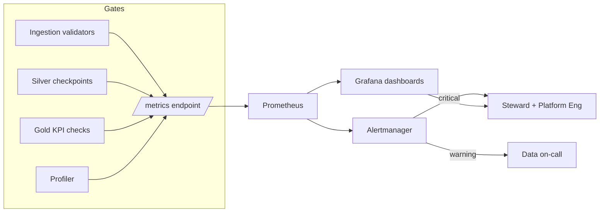

# Data Quality Monitoring Strategy

> Maps conceptual quality signals to the platform observability stack
> (Prometheus + Grafana + Alertmanager, per
> [architecture/08-observability-architecture.md](../../architecture/08-observability-architecture.md)).
> Quality gates emit metrics; Prometheus scrapes them; Grafana visualizes;
> Alertmanager routes by severity.

---

## 1. What we monitor

| Signal | Question answered | Source |
|--------|-------------------|--------|
| Failed validations | Are records failing rules? | validators / checkpoints |
| Schema changes | Did an upstream contract change? | schema registry diff |
| Null spikes | Did a field stop populating? | profiler |
| Duplicate spikes | Is a feed re-sending / fanning out? | dedup tracker |
| Late-arriving data | Is data past its window? | freshness stat |
| Pipeline failures | Did a job/task fail? | Airflow / Spark |
| Freshness SLA breaches | Is data stale vs SLA? | freshness stat |

---

## 2. Metric catalog (Prometheus)

Aligned with the observability architecture metric domains.

| Metric | Type | Labels | Meaning |
|--------|------|--------|---------|
| `dq_records_validated_total` | counter | `entity`, `layer` | Records passed through a gate |
| `dq_validation_failures_total` | counter | `entity`, `layer`, `rule` | Failed validations by rule |
| `dq_invalid_records_total` | counter | `entity`, `layer` | Records routed to quarantine |
| `dq_duplicate_ratio` | gauge | `entity` | Duplicates / total in window |
| `dq_null_pct` | gauge | `entity`, `column` | Null percentage per column |
| `dq_freshness_lag_seconds` | gauge | `entity` | `now − max(event_ts)` |
| `dq_late_arrival_pct` | gauge | `entity` | Share arriving past window |
| `dq_schema_change_total` | counter | `entity` | Detected schema diffs |
| `dq_checkpoint_pass` | gauge (0/1) | `entity`, `layer` | Last checkpoint outcome |
| `dq_psi` | gauge | `entity`, `column` | Population stability index |
| `dq_completeness_score` | gauge | `entity` | Mean completeness (UC-25) |

The ingestion path already exposes `validation_failures_total{rule}`,
`invalid_records_total{rule}` and `duplicate_ratio`; the `dq_*` names above
standardize these across ingestion **and** transformation gates.

---

## 3. Alert rules

| Alert | Condition | Severity | Route |
|-------|-----------|----------|-------|
| `ValidationFailureSpike` | `rate(dq_validation_failures_total[15m]) > baseline·3` | warning | data-oncall |
| `QuarantineFlood` | `rate(dq_invalid_records_total[15m]) > 0.1·validated` | critical | data-oncall + steward |
| `DuplicateSpike` | `dq_duplicate_ratio > 0.05` | warning | data-oncall |
| `NullSpike` | `dq_null_pct > baseline + 0.2` | warning | steward |
| `FreshnessBreach` | `dq_freshness_lag_seconds > SLA` | critical | data-oncall |
| `SchemaChanged` | `increase(dq_schema_change_total[1h]) > 0` | critical | platform-eng |
| `CheckpointFailed` | `dq_checkpoint_pass == 0` | critical | data-oncall |
| `DriftDetected` | `dq_psi > 0.25` | warning | steward + ML |

---

## 4. Monitoring flow

---

## 5. Dashboards (Grafana)

| Dashboard | Panels |
|-----------|--------|
| **Quality Overview** | validation pass rate, quarantine rate, freshness per entity |
| **Medallion Health** | Bronze/Silver/Gold checkpoint pass, row-count reconciliation |
| **EO Use Cases** | UC-15 detection volume, UC-16 valid-pixel coverage, UC-18 suspicious share, UC-25 completeness |
| **Drift** | PSI per column, categorical share shift, null trends |
| **Freshness & SLA** | lag vs SLA, late-arrival %, volume delta |

---

## 6. Wiring failures to observability

- Ingestion validators increment `dq_validation_failures_total` and, on
  quarantine, `dq_invalid_records_total` (see
  [ingestion/quality/validators.py](../../ingestion/quality/validators.py)).
- Silver/Gold checkpoints set `dq_checkpoint_pass` and fail the Airflow task on a
  critical `CheckpointResult` (see
  [transformation/cleaning/validation_framework.py](../../transformation/cleaning/validation_framework.py)).
- A failed Airflow task raises the pipeline-failure alert already defined in the
  observability architecture; the quality alert and pipeline alert correlate on
  the `entity` label.
