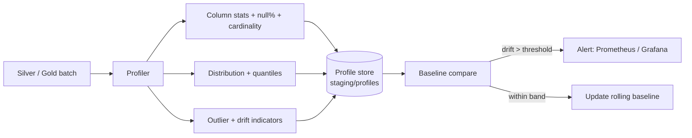

# Data Profiling Strategy

> Profiling is the *measurement* discipline that makes data quality rules
> data-driven rather than guessed. Every dataset is profiled at ingestion and
> at each medallion promotion so thresholds, drift baselines and outlier bounds
> are grounded in observed distributions.

---

## 1. Objectives

| Objective | Why it matters | Consumer |
|-----------|----------------|----------|
| Establish baselines | Turn "looks wrong" into measurable deviation | Monitoring, alerting |
| Detect drift | Catch upstream API/schema/behaviour changes early | Platform engineers, ML |
| Set thresholds | Ground validation ranges in reality | Quality rule authors |
| Surface outliers | Isolate corrupt sensor/pixel/identity records | Analysts, stewards |
| Support ML features | Feature ranges, null rates, cardinality | AI/ML pipeline |

---

## 2. Profiles by dataset

Profiling runs per Silver/Gold entity, keyed to MVP use cases.

| Entity | Key profiled columns | Focus |
|--------|----------------------|-------|
| `silver_fire` | `frp`, `confidence`, `brightness`, `geo_key` | Intensity distribution, spatial coverage |
| `silver_index` | `mean`, `valid_pixel_fraction`, `index` | Index range, cloud/no-data coverage |
| `silver_vessel` | `flag`, `imo`, `vessel_type` | Identity completeness, cardinality |
| `silver_scene` | `cloud_cover`, `completeness_score`, `collection` | Catalog completeness |
| `ref_aoi` | `area_km2`, `event_type` | Geometry sanity |
| `kpi_eo_daily` | `detections`, `mean_frp` | Aggregate stability |

---

## 3. Profiling dimensions

For every column the profiler computes:

- **Column statistics** — count, min, max, mean, median, stddev (numeric).
- **Null percentage** — `null_count / total`, tracked over time.
- **Cardinality** — distinct value count and ratio (detect enum drift).
- **Distribution** — histogram / quantiles (p05, p25, p50, p75, p95).
- **Outlier detection** — IQR fence (`< Q1 − 1.5·IQR` or `> Q3 + 1.5·IQR`) and
  z-score `|z| > 3` for approximately-normal signals.
- **Drift indicators** — population stability index (PSI) vs the rolling
  baseline; categorical share shift for enums (`flag`, `collection`, `index`).

---

## 4. Profiling flow

---

## 5. How profiling supports downstream engineering

- **Validation authoring:** ranges in the rules docs are derived from observed
  quantiles (e.g. `frp` p95 informs the outlier warn band).
- **Monitoring:** null-spike and duplicate-spike alerts compare live profiles to
  baselines (see [../monitoring/monitoring-strategy.md](../monitoring/monitoring-strategy.md)).
- **ML readiness:** the feature store consumes profiled null rates, ranges and
  cardinality to gate training data.
- **Incident triage:** a profile diff is the first artifact a steward inspects
  during an incident (see [../incidents/runbooks.md](../incidents/runbooks.md)).

---

## 6. Cadence & storage

| When | Scope | Retention |
|------|-------|-----------|
| Every batch | Lightweight (counts, null%, min/max) | 90 days |
| Daily | Full (quantiles, PSI, outliers) | 1 year (rolling baseline) |
| On schema change | Full + schema diff | Kept until certified |

Profiles are written as Parquet to `staging/profiles/<entity>/dt=<date>/` on
MinIO and surfaced in Grafana. Open-source only, laptop-friendly (16 GB RAM):
profiling is incremental and sampled for large partitions.
