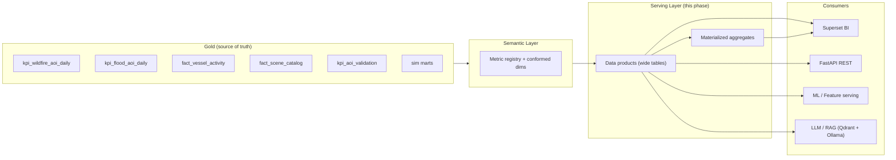

# Serving Layer (Phase 11)

> Analytics, APIs & Data Products for the Space Mission Data & AI Platform.

The Serving Layer exposes trusted, curated, governed **Gold** data as
business-ready **data products** for BI, APIs, ML, and LLM/RAG consumers. Gold is
the single serving source (ADR-SV-01); nothing consumes Silver or Bronze directly.

> **Scope alignment.** The **MVP** is the six Earth-observation / maritime use
> cases on real open data (wildfire, flood, illegal fishing, damage assessment,
> change detection, catalog quality). Spacecraft **Satellite / Mission / Launch /
> Weather** products are the post-MVP **Simulation Track** on synthetic data
> (ADR-09) and are marked `sim` throughout.

## Purpose

| Goal | How the Serving Layer delivers it |
| --- | --- |
| Trusted consumption | Only quality-gated Gold marts are served |
| Self-service analytics | Business-named, pre-joined wide tables — no runtime joins |
| One version of the truth | Metrics defined once in the semantic layer |
| Multi-consumer reuse | Same product feeds BI, API, ML, and RAG |
| Governance | RBAC, dataset classification, audit logging |

## Serving Architecture



## Data Product Philosophy

Each product is **owned**, **documented**, **SLA-bound**, and **discoverable**.
Products are denormalized for read performance and named for business users, so an
analyst never needs to know the underlying Gold grain or join keys.

## Layout

```text
serving/
├── marts/          pure-Python serving builders + semantic registry (offline-tested)
├── dbt/            dbt semantic + serving models (DuckDB / lakehouse)
├── sql/            engine-agnostic DuckDB DDL (serving tables + materialized views)
├── tests/          offline data-product + semantic tests
├── products/       data-product catalogs (per domain)
├── semantic/       semantic model + KPI catalog
├── api/            REST API design + endpoint catalog (+ stub)
├── bi/             dashboard design + dataset catalog
├── llm/            RAG serving + knowledge index
├── serving-models.md   serving model design (Task 4)
├── access-strategy.md  data access + RBAC (Task 9)
├── performance.md      performance strategy (Task 10)
├── slas.md             serving SLAs (Task 11)
├── monitoring.md       serving observability (Task 12)
├── security.md         security model (Task 13)
├── incidents.md        production incident runbook (Task 14)
├── trade-offs.md       trade-off analysis (Task 15)
└── adr.md              architecture decision records (Task 16)
```

## Data Consumers

| Consumer | Reads | Interface |
| --- | --- | --- |
| EO analysts | wildfire/flood/vessel products | Superset, REST API |
| Emergency management | wildfire, flood, validation | Superset, alerts |
| Maritime intelligence | vessel activity | Superset, REST API |
| Data stewards | scene catalog, catalog quality | Superset |
| Program leadership | platform daily KPI rollup | Superset (executive) |
| ML pipelines | offline product snapshots | Parquet / Feature Store |
| RAG assistant | curated docs + product summaries | Qdrant + Ollama |

## Enterprise Serving Principles

1. **Gold-only source** — serve curated data, never raw.
2. **Semantic single-sourcing** — one metric definition everywhere.
3. **Product ownership** — every product has an owner and SLA.
4. **Read-optimized** — wide tables + materialized aggregates over live joins.
5. **Governed access** — classified datasets behind RBAC and audit.
6. **Laptop-viable** — DuckDB serving engine, open-source only.

## Quick Start (offline)

```bash
# from serving/
& '../ingestion/.venv/Scripts/python.exe' -m pytest -q   # 16 offline tests
```

The dbt/SQL models activate once the lakehouse (MinIO + Gold Parquet) is
provisioned; the pure-Python marts under `marts/` are the canonical definitions
and run today with no infrastructure.

## Task Index

| Task | Deliverable |
| --- | --- |
| 1 Overview | this README |
| 2 Data products | [products/](products/) |
| 3 Semantic layer | [semantic/semantic-model.md](semantic/semantic-model.md), [semantic/kpi-catalog.md](semantic/kpi-catalog.md) |
| 4 Serving models | [serving-models.md](serving-models.md), `dbt/`, `sql/` |
| 5 API design | [api/api-design.md](api/api-design.md), [api/endpoint-catalog.md](api/endpoint-catalog.md) |
| 6 BI layer | [bi/dashboard-design.md](bi/dashboard-design.md), [bi/dataset-catalog.md](bi/dataset-catalog.md) |
| 7 AI data serving | [ai-data-serving.md](ai-data-serving.md) |
| 8 LLM / RAG | [llm/rag-serving.md](llm/rag-serving.md), [llm/knowledge-index.md](llm/knowledge-index.md) |
| 9 Access strategy | [access-strategy.md](access-strategy.md) |
| 10 Performance | [performance.md](performance.md) |
| 11 SLAs | [slas.md](slas.md) |
| 12 Monitoring | [monitoring.md](monitoring.md) |
| 13 Security | [security.md](security.md) |
| 14 Incidents | [incidents.md](incidents.md) |
| 15 Trade-offs | [trade-offs.md](trade-offs.md) |
| 16 ADRs | [adr.md](adr.md) |
