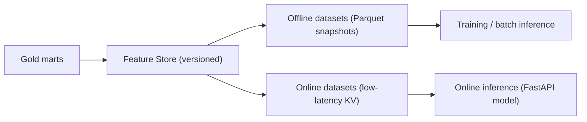

# AI Data Serving (Task 7)

The serving layer exposes curated datasets to the AI/ML subsystem
([architecture/07-ai-ml-architecture.md](../../architecture/07-ai-ml-architecture.md)).
Features are computed from **Silver and Gold**, and the serving layer publishes
the **offline** and **online** views the models read.

## Offline vs Online

| Aspect | Offline datasets | Online datasets |
| --- | --- | --- |
| Purpose | training, batch inference, backfills | online inference features |
| Storage | Parquet snapshots (point-in-time) | low-latency KV (Redis) |
| Latency | minutes–hours | milliseconds |
| Consistency | reproducible, versioned | last-known feature value |
| Source | serving products + feature store | promoted subset of offline features |

## Datasets Exposed for AI

| Consumer | Dataset | Source product |
| --- | --- | --- |
| ML training | wildfire escalation training set | `serving_wildfire_daily` + `serving_aoi_validation` labels |
| ML training | vessel-anomaly training set | `serving_vessel_activity` |
| Batch inference | daily flood-risk scoring input | `serving_flood_daily` |
| Online inference | AOI feature vector | promoted offline features (KV) |
| Feature store | AOI/day feature rows | Gold + serving products |

## Feature Serving Strategy

- **Train/serve consistency**: the same feature definitions produce offline
  (Parquet) and online (KV) values; features are versioned so a model always
  reads the version it trained on.
- **Point-in-time correctness**: offline datasets are snapshotted with `date_key`
  so training never leaks future information (no label leakage).
- **Corroboration as labels**: `kpi_aoi_validation.corroborated` provides
  cross-source ground truth for supervised EO models — a key MVP advantage over
  the synthetic Simulation-Track labels.
- **Promotion**: only features that pass drift/quality checks are promoted from
  offline to online serving.

## Boundaries

- The serving layer publishes datasets; **training and inference pipelines live in
  the AI/ML subsystem** (separate lifecycle, MLflow registry).
- Simulation-Track features (telemetry anomaly) are served for the anomaly-ML
  demonstrator only and are labelled `sim`.
