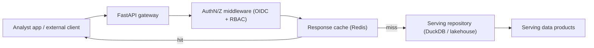

# API Serving Design (Task 5)

> **Status: stubbed for Phase 16.** This document specifies the REST contract;
> a minimal FastAPI stub lives at [app.py](app.py). Full implementation,
> auth wiring, and deployment are Phase 16 (API & Application layer).

## Architecture



The API is a **thin read layer over serving products** — it never queries Silver
or Gold directly and contains no business logic beyond shaping/pagination. All
KPI math comes from the semantic layer.

## Design Principles

| Principle | Decision |
| --- | --- |
| Framework | FastAPI (async, OpenAPI auto-docs, Pydantic validation) |
| Style | REST + JSON; resource-oriented |
| Source | serving products only (read-only) |
| Statelessness | no server session; token per request |
| Contract-first | OpenAPI generated from Pydantic models |

## Versioning Strategy

- URI versioning: `/api/v1/...`. Breaking changes ⇒ `/api/v2`, old version kept ≥ 1 release.
- Additive fields are non-breaking and shipped within a version.
- `Deprecation` + `Sunset` headers announce retirement windows (ADR-SV-03).

## Pagination

Cursor-based (stable under inserts):

```
GET /api/v1/vessels?limit=50&cursor=eyJ2ZXNzZWxfa2V5IjoiVjEwMCJ9
→ { "data": [...], "next_cursor": "...", "has_more": true }
```

`limit` default 50, max 500.

## Filtering

Whitelisted query params mapped to product columns:

```
GET /api/v1/analytics/wildfire?aoi_key=EMS-A&date_from=2026-06-01&date_to=2026-06-30&severity=high
```

Unknown filter keys return `400` (no arbitrary predicate injection).

## Search

```
GET /api/v1/scenes?q=sentinel-2&searchable=true&provider=ESA
```

Backed by the `serving_scene_catalog` product; `q` matches collection/platform.

## Authentication (conceptual)

- OIDC bearer tokens (Keycloak) validated in middleware.
- Scopes map to RBAC roles (see [../access-strategy.md](../access-strategy.md)).
- Public datasets accessible with an anonymous read scope; sensitive datasets
  require an authenticated role.

## Response Envelope

```json
{
  "data": [ ... ],
  "meta": { "count": 50, "next_cursor": "...", "generated_at": "2026-07-01T00:00:00Z" },
  "links": { "self": "/api/v1/...", "next": "/api/v1/...?cursor=..." }
}
```

## Errors

| Code | Meaning |
| --- | --- |
| 400 | invalid filter / pagination param |
| 401 | missing/expired token |
| 403 | authenticated but not authorized for dataset |
| 404 | unknown resource |
| 429 | rate limit exceeded |
| 503 | serving store unavailable / stale beyond SLA |

See [endpoint-catalog.md](endpoint-catalog.md) for the full endpoint list.
