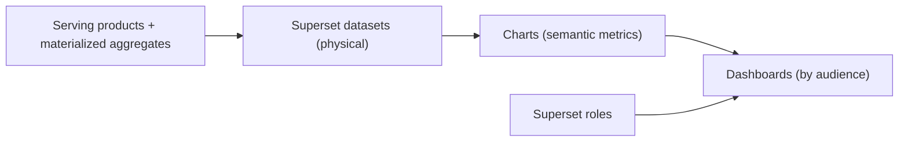

# BI Consumption Layer (Task 6)

Business intelligence is served through **Apache Superset** (open-source,
laptop-viable) reading the serving products from the DuckDB / lakehouse engine.
Superset never connects to Silver or Gold directly — only to serving datasets.

## Architecture

## Dataset Strategy

- One Superset **dataset per serving product** (thin, no ad-hoc SQL in charts).
- Superset **calculated columns are forbidden** for KPIs — metrics come from the
  serving product / semantic layer so BI and API never diverge.
- Materialized aggregates (`mv_kpi_platform_daily`, `mv_catalog_quality`) back the
  heavy executive charts to stay within the latency SLA.
- See [dataset-catalog.md](dataset-catalog.md).

## Dashboard Organization

Dashboards are grouped by **audience**, each mapped to an RBAC role.

### Executive Dashboards
- Platform Daily KPI overview (`mv_kpi_platform_daily`): fire detections, flood
  AOI-days, suspicious vessels, peak FRP — trend + today's value.
- EMS corroboration rate (trust in detections).

### Operations Dashboards
- Wildfire Activity: AOI map, severity distribution, detections by day.
- Flood Extent: NDWI trend per AOI, flood-day calendar.
- Maritime: suspicious vessels queue, review-priority table.

### Engineering Dashboards
- Catalog Quality (`mv_catalog_quality`): searchable rate, mean completeness,
  cloud cover by collection.
- Data freshness & serving-refresh status (from monitoring metrics).

### AI Dashboards
- Feature freshness and offline dataset row counts.
- Simulation-Track: satellite health status distribution, launch success trend
  (clearly labelled `sim`).

## KPI Management

- KPIs displayed in BI are the semantic-layer metrics
  ([../semantic/kpi-catalog.md](../semantic/kpi-catalog.md)).
- Chart definitions reference product columns; thresholds (severity, quality
  band) are pre-computed in the product, so all users see identical banding.

## User Groups

| Superset role | Dashboards | Datasets |
| --- | --- | --- |
| `exec` | Executive | platform daily, validation |
| `ops_eo` | Operations (EO) | wildfire, flood, validation |
| `ops_maritime` | Operations (Maritime) | vessel activity |
| `steward` | Engineering | scene catalog, catalog quality |
| `ai` | AI | feature/offline datasets, sim marts |
| `demo` | Simulation-Track | satellite/launch/weather (sim) |

Row-level security policies restrict `ops_maritime` to maritime datasets, etc.
(see [../security.md](../security.md)).
