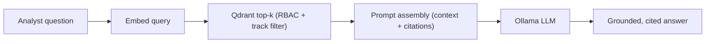

# LLM / RAG Serving (Task 8)

The knowledge-serving layer exposes curated content to the local RAG assistant
(Qdrant vector store + Ollama LLM, per
[architecture/07-ai-ml-architecture.md](../../architecture/07-ai-ml-architecture.md)).
It answers analyst questions **grounded in platform data and documentation** — not
from model parametric memory.

## What Gets Indexed

| Content | Source | Why |
| --- | --- | --- |
| Data-product summaries | daily serving products (wildfire/flood/vessel/validation) | answer "what happened in AOI X" |
| Scene/catalog metadata | `serving_scene_catalog` | imagery discovery Q&A |
| Mission & platform docs | `docs/`, `architecture/` | design/ops questions |
| Incident reports | [../incidents.md](../incidents.md), quality incidents | "has this happened before" |
| Operational runbooks | serving/quality runbooks | guided remediation |

> **Excluded from the index:** raw Bronze/Silver rows, secrets, and any sensitive
> dataset (see retrieval boundaries below). Only Gold-derived, serveable content
> is embedded.

## Chunking Strategy

| Content type | Chunk unit | Size | Overlap |
| --- | --- | --- | --- |
| Markdown docs | heading section | ~800 tokens | 100 tokens |
| Data-product summaries | one AOI/day narrative | 1 record | none |
| Incident reports | per incident (symptoms→resolution) | 1 incident | none |
| Catalog metadata | one scene | 1 record | none |

Record-oriented content (products, scenes, incidents) is chunked **one entity per
chunk** so retrieval returns a self-contained, citable unit.

## Metadata Strategy

Every chunk carries filterable metadata for scoped retrieval and citation:

```json
{
  "source": "serving_wildfire_daily",
  "use_case": "UC-15",
  "aoi_key": "EMS-A",
  "date_key": "2026-06-03",
  "classification": "internal",
  "track": "mvp"
}
```

## Retrieval Boundaries

- Retrieval is filtered by the caller's RBAC scope — sensitive-classified chunks
  are never returned to an unauthorized user (metadata `classification` filter).
- `track = sim` chunks are only retrieved in the demo assistant context and are
  labelled as synthetic in the answer.
- Answers must cite the `source` + key of retrieved chunks; uncited claims are
  suppressed (grounding requirement).
- Freshness: product-summary chunks are re-embedded after each serving refresh so
  the assistant never answers from stale summaries.

## Flow



See [knowledge-index.md](knowledge-index.md) for the concrete index definition.
