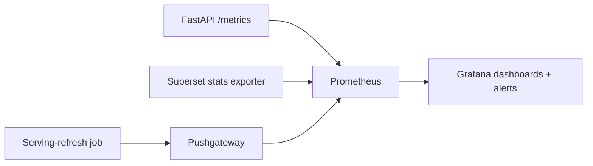

# Monitoring the Serving Layer (Task 12)

Serving observability plugs into the platform Prometheus + Grafana stack
([architecture/08-observability-architecture.md](../../architecture/08-observability-architecture.md)).
Metrics are namespaced `serving_*` (consistent with the quality layer's `dq_*`).

## Metrics

| Metric | Type | Meaning | SLA link |
| --- | --- | --- | --- |
| `serving_api_request_duration_seconds{endpoint}` | histogram | API latency | API latency SLA |
| `serving_api_requests_total{endpoint,status}` | counter | request volume + errors | availability |
| `serving_query_duration_seconds{model}` | histogram | serving-store query time | query performance |
| `serving_dashboard_render_seconds{dashboard}` | histogram | Superset render time | dashboard SLA |
| `serving_cache_hits_total{layer}` / `serving_cache_misses_total{layer}` | counter | cache hit ratio | performance |
| `serving_dataset_freshness_seconds{product}` | gauge | age of newest data | freshness SLA |
| `serving_refresh_status{product}` | gauge | last refresh success/fail (1/0) | freshness |
| `serving_active_consumers{role}` | gauge | consumer activity | capacity |

## Metric → Tool Mapping

| Concern | Prometheus source | Grafana view |
| --- | --- | --- |
| API latency | histogram quantiles | latency heatmap + p95 panel |
| Query duration | per-model histogram | slow-model table |
| Dashboard performance | render histogram | render p95 by dashboard |
| Cache hit ratio | hits/(hits+misses) | ratio gauge + alert < 70 % |
| Consumer activity | active-consumer gauge | usage by role |
| Dataset freshness | freshness gauge | freshness by product + alert > 24 h |

## Alerts

| Alert | Condition | Severity |
| --- | --- | --- |
| API p95 breach | `serving_api_request_duration_seconds` p95 > SLA for 5 m | warning |
| Stale dataset | `serving_dataset_freshness_seconds` > 86400 | critical |
| Refresh failed | `serving_refresh_status` == 0 | critical |
| Low cache hit | ratio < 0.7 for 15 m | info |
| Error spike | 5xx rate > 2 % for 5 m | critical |

Alerts route to the on-call channel and reference [incidents.md](incidents.md).
