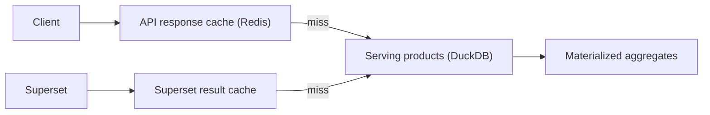

# Performance Strategy (Task 10)

The serving layer is engineered so dashboards and APIs stay fast on the 16 GB
laptop target without a heavyweight distributed engine.

## Techniques

| Technique | What | Where |
| --- | --- | --- |
| Wide data products | denormalized, pre-joined tables — no runtime joins | `serving.serving_*` |
| Pre-computed aggregates | daily/collection rollups | `serving_agg.mv_*` |
| Materialized views | rebuilt after Gold, not queried live from Silver | `sql/02_materialized_views.sql` |
| Query caching | Superset result cache | BI layer |
| API caching | Redis response cache keyed by endpoint+filters | API (Phase 16) |
| Columnar storage | Parquet + DuckDB vectorized scans | serving engine |
| Partition pruning | filter by `date_key` reads only needed files | Gold Parquet |

## Read-Path Sizing

At MVP grain the serving products are small (AOI/day, scene, vessel/day), so:

- Full-scan queries on a data product are sub-second in DuckDB.
- The executive dashboard reads `mv_kpi_platform_daily` (1 row/day) — trivially fast.
- Heavy cross-product math is pre-computed nightly, not at query time.

## Caching Layers

| Cache | TTL | Invalidation |
| --- | --- | --- |
| API response | 5 min | on serving refresh event |
| Superset result | 1 h (products), 15 min (aggregates) | on serving refresh |
| Materialized aggregate | rebuilt daily | serving-refresh DAG |

## Dataset Optimization

- Keep products **narrow** (only serving-relevant columns) to shrink scans.
- Sort/cluster Parquet by `date_key` (then `aoi_key`) for range-filter pruning.
- Prefer additive daily partitions over full rewrites as volumes grow (ADR-SV-04).

## Anti-Patterns Avoided

- No live joins across Gold marts in dashboards (pushed into products).
- No per-chart ad-hoc SQL in Superset (fixed physical datasets).
- No serving reads against Silver/Bronze (Gold-only, ADR-SV-01).
