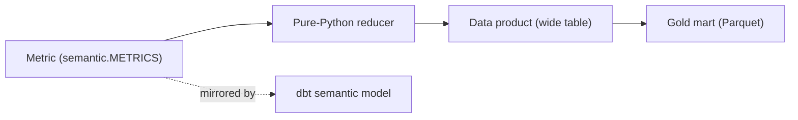

# Semantic Model (Task 3)

The semantic layer decouples **business meaning** from **physical storage** so
every consumer — BI, API, ML, RAG — reads one definition of every metric and
dimension. It is single-sourced in code at
[../marts/semantic.py](../marts/semantic.py) (the `METRICS` and `DIMENSIONS`
registries) and mirrored by the dbt semantic models under
[../dbt/models/semantic/](../dbt/models/semantic/).

## Why Semantic Consistency Matters

| Without a semantic layer | With a semantic layer |
| --- | --- |
| "Success rate" computed 3 ways in 3 dashboards | one reducer, one answer |
| Analysts reverse-engineer join keys | business names, pre-joined products |
| KPI drift between BI and API | BI and API call the same definition |
| Silent typos return empty KPIs | unknown metric fails fast (`KeyError`) |

## Business-Friendly Naming

| Physical (Gold) | Business name |
| --- | --- |
| `kpi_wildfire_aoi_daily.detections` | Fire Detections |
| `kpi_wildfire_aoi_daily.max_frp` | Peak Fire Radiative Power |
| `kpi_flood_aoi_daily.flood_flag` | Flood Day |
| `fact_vessel_activity.suspicious_flag` | Suspicious Vessel |
| `fact_scene_catalog.is_searchable` | Searchable Scene |
| `kpi_aoi_validation.corroborated` | EMS Corroborated |

## Standard Dimensions

| Dimension | Key | Grain |
| --- | --- | --- |
| `dim_date` | `date_key` | calendar day (UTC) |
| `dim_aoi` | `aoi_key` | Copernicus-EMS activation footprint |
| `dim_geo` | `geo_key` | quantized lat/lon grid cell |
| `dim_vessel` | `vessel_key` | vessel identity (MMSI/IMO) |
| `dim_provider` | `provider_key` | launch/data provider (sim) |
| `dim_satellite` | `sat_key` | spacecraft (sim) |

Dimensions are **conformed**: `date_key` and `aoi_key` mean the same thing across
every product, which is what makes cross-product rollups (e.g.
`mv_kpi_platform_daily`) valid.

## Standard Measures

| Measure | Reducer | Applies to |
| --- | --- | --- |
| sum | `Σ field` | detections, transmissions |
| mean | `avg(field)` where non-null | mean_frp, health_score |
| rate | `count(flag)/count(*)` | flood_day_rate, searchable_rate |

## Metric → Product → Storage Traceability

Any KPI on any dashboard can be traced: metric → reducer → product → Gold mart →
Silver → Bronze → source, satisfying the platform lineage requirement.

## Governance

- New metrics are added **only** in `semantic.METRICS` (reviewed in PR).
- Dashboards and endpoints must reference registered metric names, never inline SQL.
- The KPI catalog ([kpi-catalog.md](kpi-catalog.md)) is generated from the registry.
