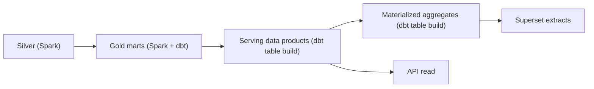

# Serving Models (Task 4)

Serving models are the physical read layer built on Gold. They come in four
shapes, each chosen for a consumer access pattern.

## Model Types

| Type | Purpose | Example | Materialization |
| --- | --- | --- | --- |
| Wide table | denormalized data product, no runtime joins | `serving_wildfire_daily` | table |
| Aggregated table | pre-computed cross-product rollup | `mv_kpi_platform_daily` | table (materialized view tier) |
| Time-series view | per-day series for trend charts | wildfire/flood by `date_key` | view over wide table |
| Snapshot table | point-in-time catalog state | `serving_scene_catalog` | table (1 row/scene) |
| Semantic view | business-named dimension | `dim_aoi` | view |

## Implementation Map

| Model | Python builder | dbt model | SQL DDL |
| --- | --- | --- | --- |
| `serving_wildfire_daily` | `serve_wildfire_daily` | `dbt/models/serving/serving_wildfire_daily.sql` | `sql/01_serving_tables.sql` |
| `serving_flood_daily` | `serve_flood_daily` | `serving_flood_daily.sql` | `sql/01_serving_tables.sql` |
| `serving_vessel_activity` | `serve_vessel_activity` | `serving_vessel_activity.sql` | `sql/01_serving_tables.sql` |
| `serving_scene_catalog` | `serve_scene_catalog` | `serving_scene_catalog.sql` | `sql/01_serving_tables.sql` |
| `serving_aoi_validation` | `serve_aoi_validation` | `serving_aoi_validation.sql` | `sql/01_serving_tables.sql` |
| `mv_kpi_platform_daily` | — (SQL rollup) | `marts_agg/mv_kpi_platform_daily.sql` | `sql/02_materialized_views.sql` |
| `dim_aoi` | — | `semantic/dim_aoi.sql` | `sql/01_serving_tables.sql` |

The pure-Python builders are the **canonical definition** (offline unit-tested);
the dbt and DDL variants apply the same logic at scale on DuckDB / the lakehouse.

## Engine Boundaries

| Engine | Owns | Path |
| --- | --- | --- |
| Pure-Python | canonical serving logic + tests | `marts/`, `tests/` |
| dbt (DuckDB) | serving tables, aggregates, tests | `dbt/` |
| DuckDB SQL | direct DDL / no-dbt bootstrap | `sql/` |

## Refresh Model

Serving models rebuild **after** Gold completes, orchestrated by the Airflow
serving-refresh step (extends the transformation DAG). Because products are small
(AOI/day, scene grain), a full rebuild is cheaper and simpler than incremental
merge at MVP scale — revisit with incremental models when volumes grow (ADR-SV-04).

## Contracts & Tests

- dbt schema tests enforce grain uniqueness, KPI ranges, and enumerated bands
  ([../dbt/models/serving/_serving.yml](../dbt/models/serving/_serving.yml)).
- Offline pytest validates the Python builders against real Gold field names
  ([../tests/](../tests/)).
